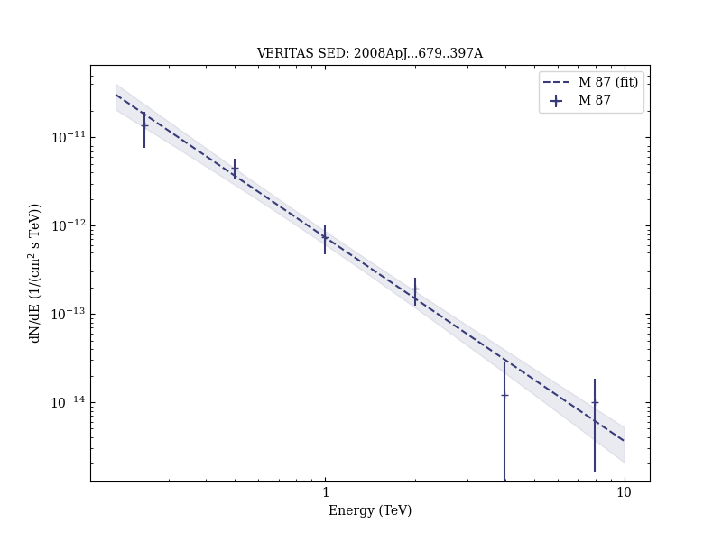

# Observation of Gamma-Ray Emission from the Galaxy M87 above 250 GeV with VERITAS

Reference:
Acciari, V. A. et al. (The VERITAS Collaboration), The Astrophysical Journal, 679, 397 (2008)

- ADS: [2008ApJ...679..397A](http://adsabs.harvard.edu/abs/2008ApJ...679..397A)
- DOI: [10.1086/587458](https://doi.org/10.1086/587458)

## M 87 (VER J1230+123)
### Data files

- observation data: [VER-000058.yaml](VER-000058.yaml)  
- spectral data: [VER-000058-sed.ecsv](VER-000058-sed.ecsv)  
- light-curve data: [VER-000058-lc.ecsv](VER-000058-lc.ecsv)  
- observation data and fit results: [VER-000058.yaml](VER-000058.yaml)  

### Figures

