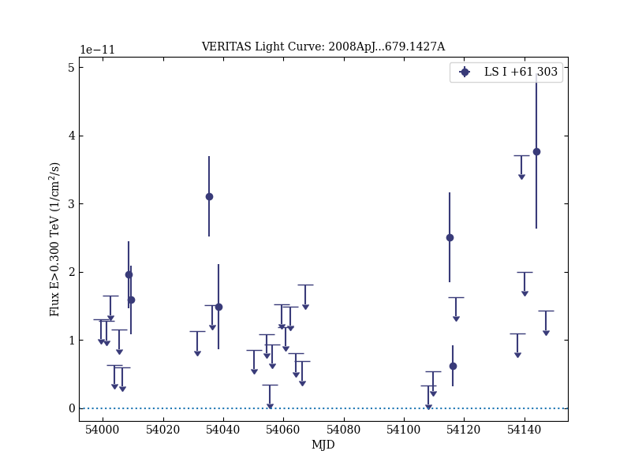

# VERITAS Observations of the γ-Ray Binary LS I +61 303

Reference:
Acciari, V. A. et al. (The VERITAS Collaboration), The Astrophysical Journal, 679, 1427 (2008)

- ADS: [2008ApJ...679.1427A](http://adsabs.harvard.edu/abs/2008ApJ...679.1427A)
- DOI: [10.1086/587736](https://doi.org/10.1086/587736)

## LS I +61 303 (VER J0240+612)
### Data files

- observation data: [VER-000014.yaml](VER-000014.yaml)  
- spectral data: [VER-000014-sed.ecsv](VER-000014-sed.ecsv)  
- light-curve data: [VER-000014-lc.ecsv](VER-000014-lc.ecsv)  
- observation data and fit results: [VER-000014.yaml](VER-000014.yaml)  

### Figures

