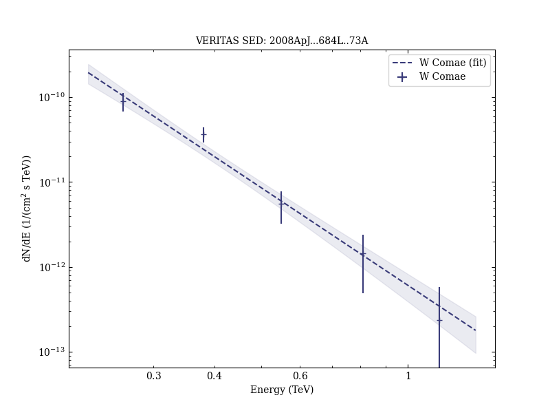

# VERITAS Discovery of &gt;200 GeV Gamma-Ray Emission from the Intermediate-Frequency-Peaked BL Lacertae Object W Comae

Reference:
Acciari, V. A. et al. (The VERITAS Collaboration), The Astrophysical Journal, 684, L73 (2008)

- ADS: [2008ApJ...684L..73A](http://adsabs.harvard.edu/abs/2008ApJ...684L..73A)
- DOI: [10.1086/592244](https://doi.org/10.1086/592244)

## W Comae
### Data files

- observation data: [VER-000054.yaml](VER-000054.yaml)  
- spectral data: [VER-000054-sed.ecsv](VER-000054-sed.ecsv)  
- light-curve data: [VER-000054-lc.ecsv](VER-000054-lc.ecsv)  
- observation data and fit results: [VER-000054.yaml](VER-000054.yaml)  

### Figures

