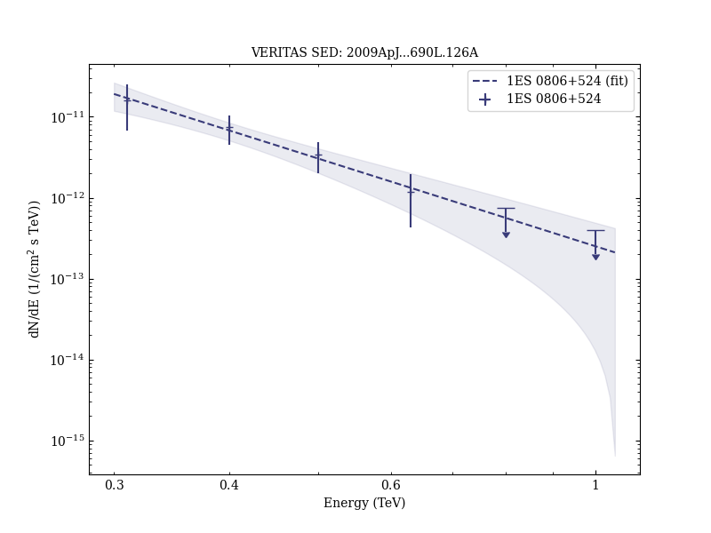

# Discovery of Very High Energy Gamma-ray Radiation from the BL Lac 1ES 0806+524

Reference:
Acciari, V. et al. (The VERITAS Collaboration), The Astrophysical Journal, 690, L126 (2009)

- ADS: [2009ApJ...690L.126A](http://adsabs.harvard.edu/abs/2009ApJ...690L.126A)
- DOI: [10.1088/0004-637X/690/2/L126](https://doi.org/10.1088/0004-637X/690/2/L126)

## 1ES 0806+524
### Data files

- observation data: [VER-000036.yaml](VER-000036.yaml)  
- spectral data: [VER-000036-sed.ecsv](VER-000036-sed.ecsv)  
- light-curve data: [VER-000036-lc.ecsv](VER-000036-lc.ecsv)  
- observation data and fit results: [VER-000036.yaml](VER-000036.yaml)  

### Figures

