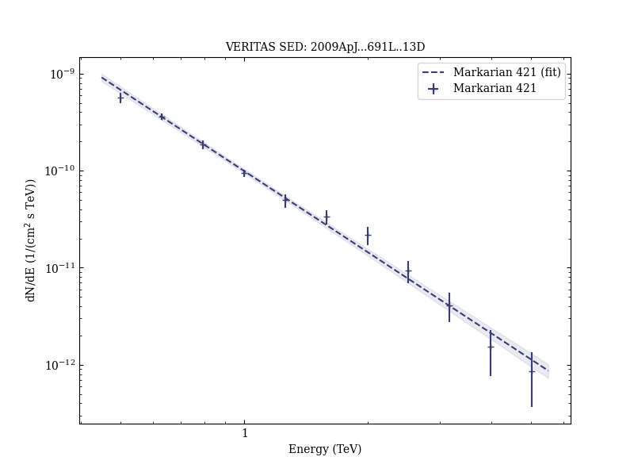

# The June 2008 Flare of Markarian 421 from Optical to TeV Energies

Reference:
Donnarumma, I. et al. (The VERITAS Collaboration), The Astrophysical Journal, 691, L13 (2009)

- ADS: [2009ApJ...691L..13D](http://adsabs.harvard.edu/abs/2009ApJ...691L..13D)
- DOI: [10.1088/0004-637X/691/1/L13](https://doi.org/10.1088/0004-637X/691/1/L13)

## Markarian 421 (VER J1104+382)
### Data files

- observation data: [VER-000049.yaml](VER-000049.yaml)
- spectral data: [VER-000049-sed.ecsv](VER-000049-sed.ecsv)
- light-curve data: [VER-000049-lc.ecsv](VER-000049-lc.ecsv)
- observation data and fit results: [VER-000049.yaml](VER-000049.yaml)

### Figures

