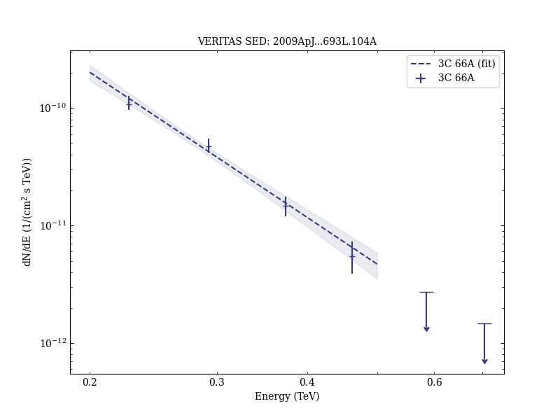

# Veritas Observations of a Very High Energy γ-Ray Flare From the Blazar 3C 66A

Reference:
Acciari, V. A. et al. (The VERITAS Collaboration), The Astrophysical Journal, 693, L104 (2009)

- ADS: [2009ApJ...693L.104A](http://adsabs.harvard.edu/abs/2009ApJ...693L.104A)
- DOI: [10.1088/0004-637X/693/2/L104](https://doi.org/10.1088/0004-637X/693/2/L104)

## 3C 66A (VER J0222+430)
### Data files

- observation data: [VER-000011.yaml](VER-000011.yaml)
- spectral data: [VER-000011-sed.ecsv](VER-000011-sed.ecsv)
- light-curve data: [VER-000011-lc-1.ecsv](VER-000011-lc-1.ecsv)  [VER-000011-lc-2.ecsv](VER-000011-lc-2.ecsv)
- observation data and fit results: [VER-000011.yaml](VER-000011.yaml)

### Figures

