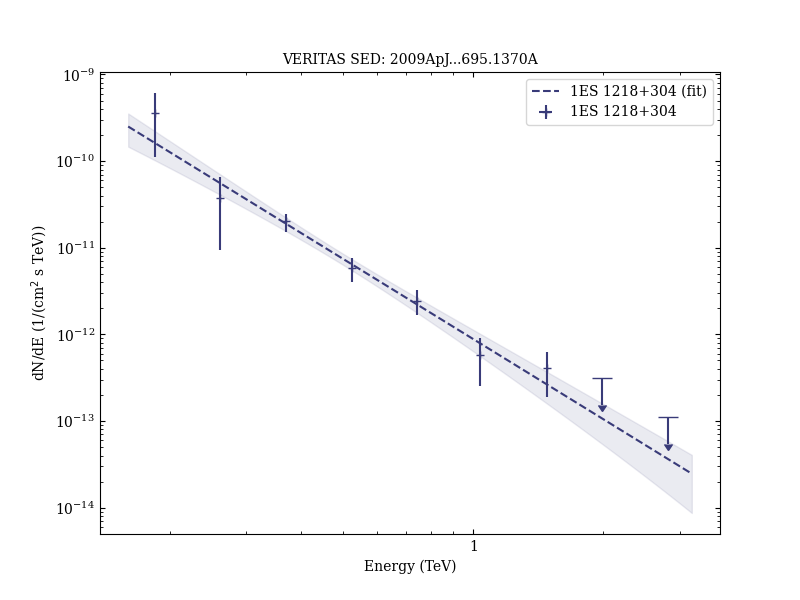

# VERITAS Observations of the BL Lac Object 1ES 1218+304

Reference:
Acciari, V. A. et al. (The VERITAS Collaboration), The Astrophysical Journal, 695, 1370 (2009)

- ADS: [2009ApJ...695.1370A](http://adsabs.harvard.edu/abs/2009ApJ...695.1370A)
- DOI: [10.1088/0004-637X/695/2/1370](https://doi.org/10.1088/0004-637X/695/2/1370)

## 1ES 1218+304 (VER J1221+301)
### Data files

- observation data: [VER-000055.yaml](VER-000055.yaml)  
- spectral data: [VER-000055-sed.ecsv](VER-000055-sed.ecsv)  
- light-curve data: [VER-000055-lc.ecsv](VER-000055-lc.ecsv)  
- observation data and fit results: [VER-000055.yaml](VER-000055.yaml)  

### Figures

