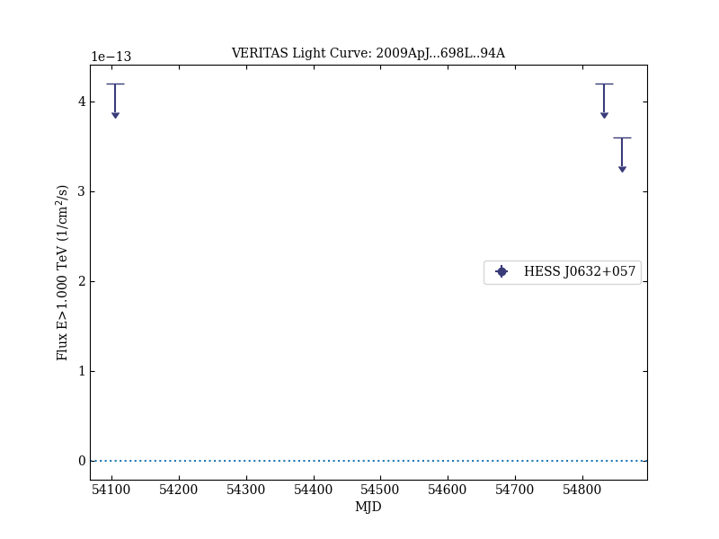

# Evidence for Long-Term Gamma-Ray and X-Ray Variability from the Unidentified TeV Source HESS J0632+057

Reference:
Acciari, V. A. et al. (The VERITAS Collaboration), The Astrophysical Journal, 698, L94 (2009)

- ADS: [2009ApJ...698L..94A](http://adsabs.harvard.edu/abs/2009ApJ...698L..94A)
- DOI: [10.1088/0004-637X/698/2/L94](https://doi.org/10.1088/0004-637X/698/2/L94)

## HESS J0632+057 (VER J0633+057)
### Data files

- observation data: [VER-000030.yaml](VER-000030.yaml)  
- light-curve data: [VER-000030-lc.ecsv](VER-000030-lc.ecsv)  
- observation data and fit results: [VER-000030.yaml](VER-000030.yaml)  

### Figures

