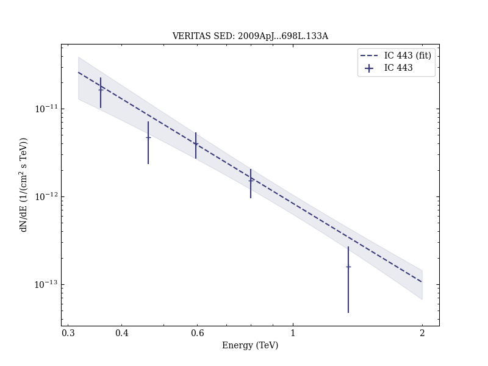

# Observation of Extended Very High Energy Emission from the Supernova Remnant IC 443 with VERITAS

Reference:
Acciari, V. A. et al. (The VERITAS Collaboration), The Astrophysical Journal, 698, L133 (2009)

- ADS: [2009ApJ...698L.133A](http://adsabs.harvard.edu/abs/2009ApJ...698L.133A)
- DOI: [10.1088/0004-637X/698/2/L133](https://doi.org/10.1088/0004-637X/698/2/L133)

## IC 443 (VER J0616+223)
### Data files

- observation data: [VER-000029.yaml](VER-000029.yaml)
- spectral data: [VER-000029-sed.ecsv](VER-000029-sed.ecsv)
- observation data and fit results: [VER-000029.yaml](VER-000029.yaml)
- FITS data: [VER-000029-skymap.fits](VER-000029-skymap.fits)

### Figures

