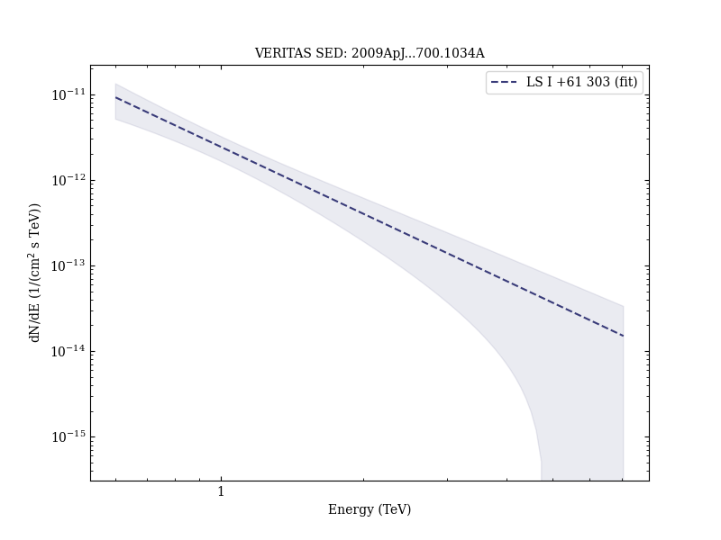

# Multiwavelength Observations of LS I +61° 303 with Veritas, Swift, and RXTE

Reference:
Acciari, V. A. et al. (The VERITAS Collaboration), The Astrophysical Journal, 700, 1034 (2009)

- ADS: [2009ApJ...700.1034A](http://adsabs.harvard.edu/abs/2009ApJ...700.1034A)
- DOI: [10.1088/0004-637X/700/2/1034](https://doi.org/10.1088/0004-637X/700/2/1034)

## LS I +61 303 (VER J0240+612)
### Data files

- observation data: [VER-000014-1.yaml](VER-000014-1.yaml)  [VER-000014-2.yaml](VER-000014-2.yaml)  
- spectral data: [VER-000014-sed.ecsv](VER-000014-sed.ecsv)  
- light-curve data: [VER-000014-lc.ecsv](VER-000014-lc.ecsv)  
- observation data and fit results: [VER-000014-1.yaml](VER-000014-1.yaml)  [VER-000014-2.yaml](VER-000014-2.yaml)  

### Figures

