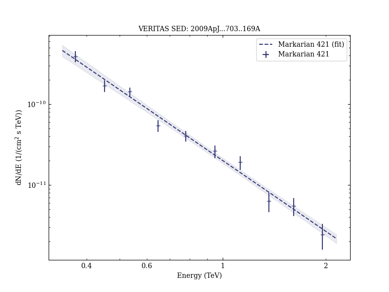

# Simultaneous Multiwavelength Observations of Markarian 421 During Outburst

Reference:
Acciari, V. A. et al. (The WHIPPLE, VERITAS, and MAGIC Collaborations), The Astrophysical Journal, 703, 169 (2009)

- ADS: [2009ApJ...703..169A](http://adsabs.harvard.edu/abs/2009ApJ...703..169A)
- DOI: [10.1088/0004-637X/703/1/169](https://doi.org/10.1088/0004-637X/703/1/169)

## Markarian 421
### Data files

- observation data: [VER-000049.yaml](VER-000049.yaml)  
- spectral data: [VER-000049-sed.ecsv](VER-000049-sed.ecsv)  
- light-curve data: [VER-000049-lc.ecsv](VER-000049-lc.ecsv)  
- observation data and fit results: [VER-000049.yaml](VER-000049.yaml)  

### Figures

