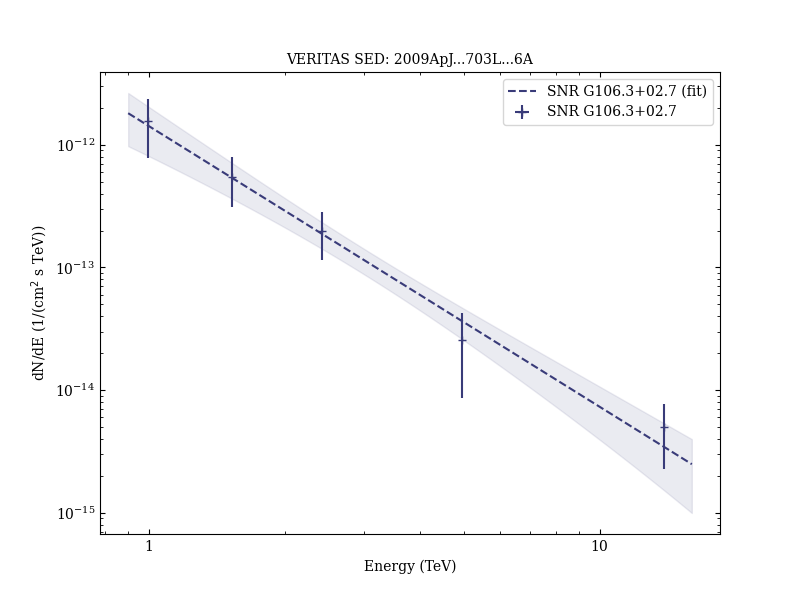

# Detection of Extended VHE Gamma Ray Emission from G106.3+2.7 with Veritas

Reference:
Acciari, V. A. et al. (The VERITAS Collaboration), The Astrophysical Journal, 703, L6 (2009)

- ADS: [2009ApJ...703L...6A](http://adsabs.harvard.edu/abs/2009ApJ...703L...6A)
- DOI: [10.1088/0004-637X/703/1/L6](https://doi.org/10.1088/0004-637X/703/1/L6)

## SNR G106.3+02.7 (VER J2227+608)
### Data files

- observation data: [VER-000149.yaml](VER-000149.yaml)
- spectral data: [VER-000149-sed.ecsv](VER-000149-sed.ecsv)
- observation data and fit results: [VER-000149.yaml](VER-000149.yaml)

### Figures

