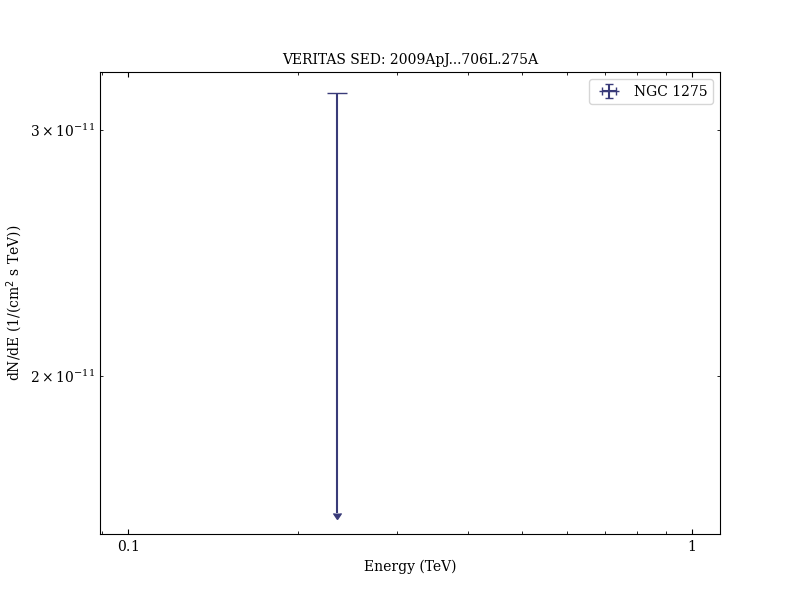
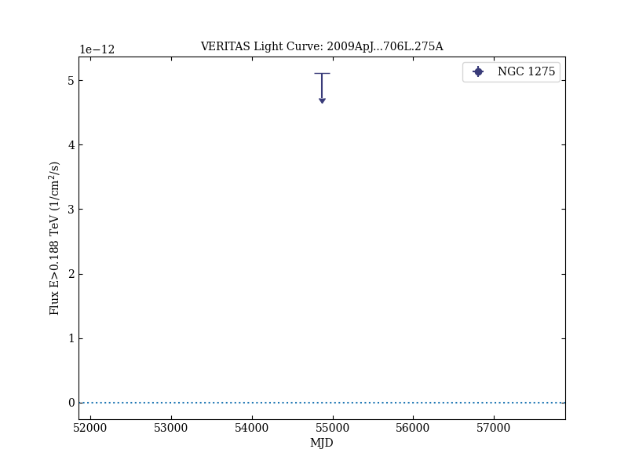
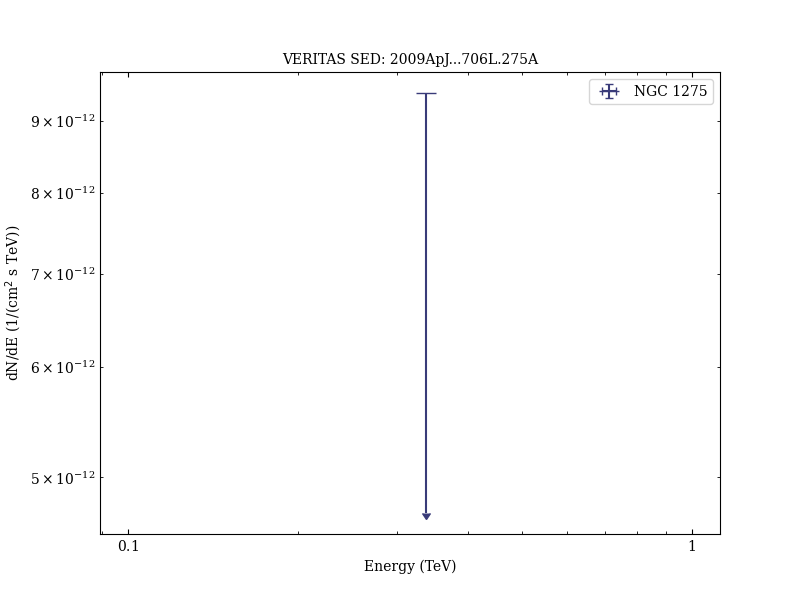

# VERITAS Upper Limit on the Very High Energy Emission from the Radio Galaxy NGC 1275

Reference:
Acciari, V. A. et al. (The VERITAS Collaboration), The Astrophysical Journal, 706, L275 (2009)

- ADS: [2009ApJ...706L.275A](http://adsabs.harvard.edu/abs/2009ApJ...706L.275A)
- DOI: [10.1088/0004-637X/706/2/L275](https://doi.org/10.1088/0004-637X/706/2/L275)

## NGC 1275 (VER J0319+415)
### Data files

- spectral data: [VER-000018-sed-1.ecsv](VER-000018-sed-1.ecsv)  [VER-000018-sed-2.ecsv](VER-000018-sed-2.ecsv)
- light-curve data: [VER-000018-lc-1.ecsv](VER-000018-lc-1.ecsv)  [VER-000018-lc-2.ecsv](VER-000018-lc-2.ecsv)

### Figures

