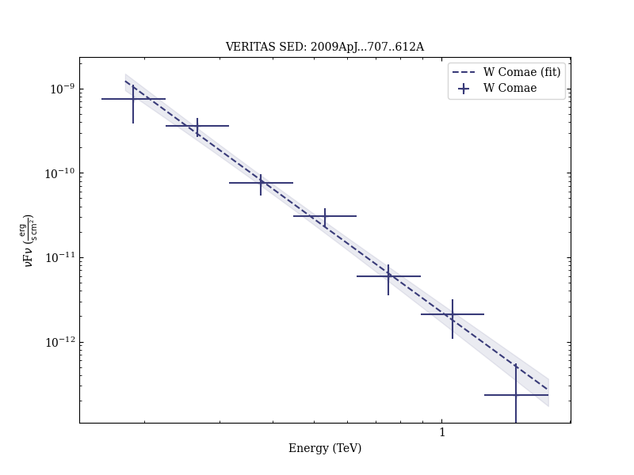

# Multiwavelength Observations of a TeV-Flare from W Comae

Reference:
Acciari, V. A. et al. (The VERITAS Collaboration), The Astrophysical Journal, 707, 612 (2009)

- ADS: [2009ApJ...707..612A](http://adsabs.harvard.edu/abs/2009ApJ...707..612A)
- DOI: [10.1088/0004-637X/707/1/612](https://doi.org/10.1088/0004-637X/707/1/612)

## W Comae (VER J1221+282)
### Data files

- observation data: [VER-000054.yaml](VER-000054.yaml)
- spectral data: [VER-000054-sed.ecsv](VER-000054-sed.ecsv)
- light-curve data: [VER-000054-lc.ecsv](VER-000054-lc.ecsv)
- observation data and fit results: [VER-000054.yaml](VER-000054.yaml)

### Figures

