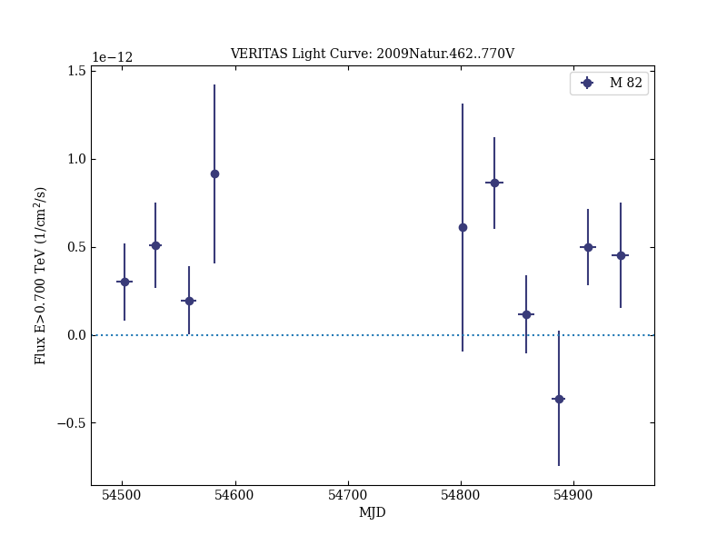
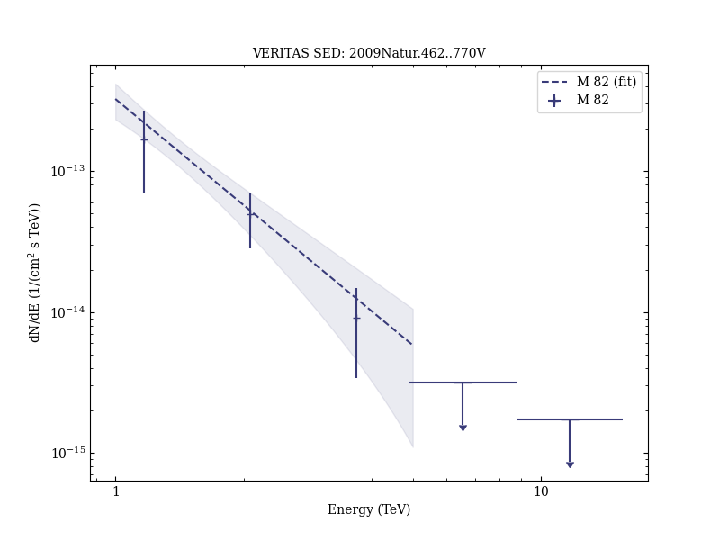

# A connection between star formation activity and cosmic rays in the starburst galaxy M82

Reference:
VERITAS Collaboration et al. (The VERITAS Collaboration), Nature, 462, 770 (2009)

- ADS: [2009Natur.462..770V](http://adsabs.harvard.edu/abs/2009Natur.462..770V)
- DOI: [10.1038/nature08557](https://doi.org/10.1038/nature08557)

## M 82 (VER J0955+696)
### Data files

- observation data: [VER-000040.yaml](VER-000040.yaml)
- spectral data: [VER-000040-sed.ecsv](VER-000040-sed.ecsv)
- light-curve data: [VER-000040-lc.ecsv](VER-000040-lc.ecsv)
- observation data and fit results: [VER-000040.yaml](VER-000040.yaml)

### Figures

