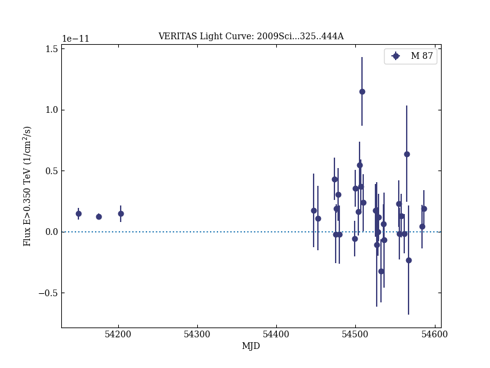

# Radio Imaging of the Very-High-Energy γ-Ray Emission Region in the Central Engine of a Radio Galaxy

Reference:
Acciari, V. A. et al. (The VERITAS, HESS, and MAGIC Collaborations), Science, 325, 444 (2009)

- ADS: [2009Sci...325..444A](http://adsabs.harvard.edu/abs/2009Sci...325..444A)
- DOI: [10.1126/science.1175406](https://doi.org/10.1126/science.1175406)

## M 87 (VER J1230+123)
### Data files

- observation data: [VER-000058.yaml](VER-000058.yaml)  
- light-curve data: [VER-000058-lc-1.ecsv](VER-000058-lc-1.ecsv)  
- observation data and fit results: [VER-000058.yaml](VER-000058.yaml)  

### Figures

