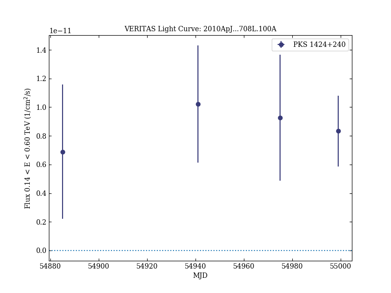
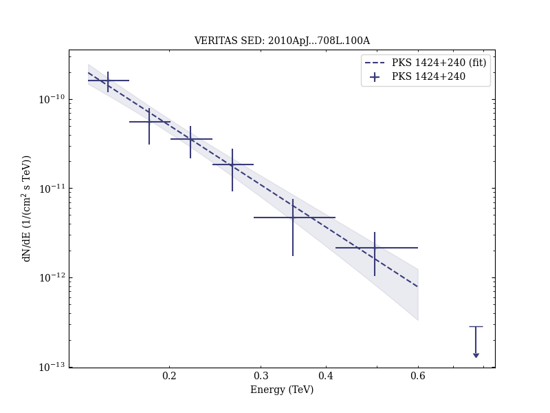

# Discovery of Very High Energy Gamma Rays from PKS 1424+240 and Multiwavelength Constraints on Its Redshift

Reference:
Acciari, V. A. et al. (The VERITAS Collaboration), The Astrophysical Journal, 708, L100 (2010)

- ADS: [2010ApJ...708L.100A](http://adsabs.harvard.edu/abs/2010ApJ...708L.100A)
- DOI: [10.1088/2041-8205/708/2/L100](https://doi.org/10.1088/2041-8205/708/2/L100)

## PKS 1424+240 (VER J1427+237)
### Data files

- observation data: [VER-000067.yaml](VER-000067.yaml)
- spectral data: [VER-000067-sed.ecsv](VER-000067-sed.ecsv)
- light-curve data: [VER-000067-lc.ecsv](VER-000067-lc.ecsv)
- observation data and fit results: [VER-000067.yaml](VER-000067.yaml)

### Figures

