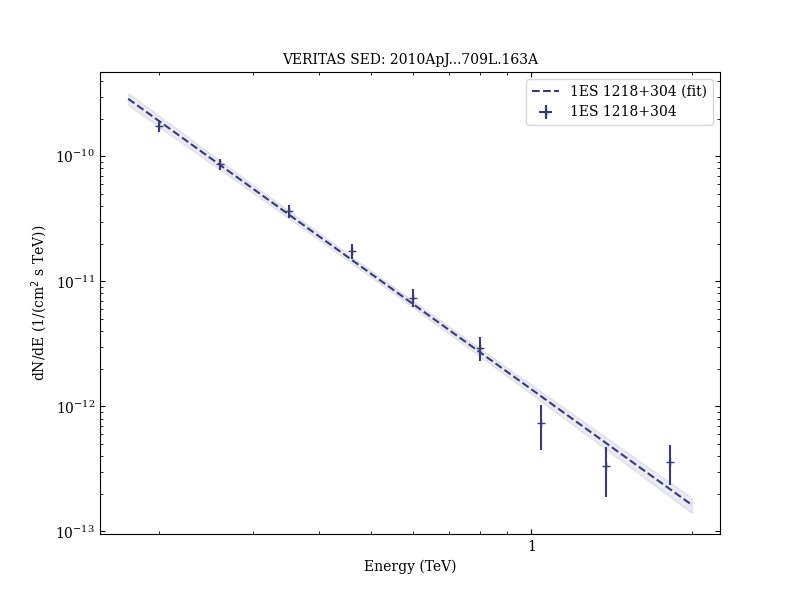
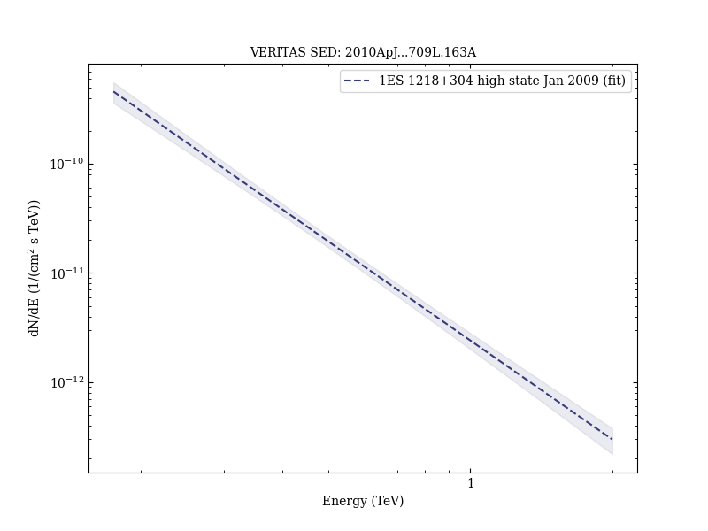

# Discovery of Variability in the Very High Energy γ-Ray Emission of 1ES 1218+304 with VERITAS

Reference:
Acciari, V. A. et al. (The VERITAS Collaboration), The Astrophysical Journal, 709, L163 (2010)

- ADS: [2010ApJ...709L.163A](http://adsabs.harvard.edu/abs/2010ApJ...709L.163A)
- DOI: [10.1088/2041-8205/709/2/L163](https://doi.org/10.1088/2041-8205/709/2/L163)

## 1ES 1218+304 (VER J1221+301)
### Data files

- observation data: [VER-000055-1.yaml](VER-000055-1.yaml)  [VER-000055-2.yaml](VER-000055-2.yaml)  [VER-000055-3.yaml](VER-000055-3.yaml)
- spectral data: [VER-000055-sed-1.ecsv](VER-000055-sed-1.ecsv)
- light-curve data: [VER-000055-lc-1.ecsv](VER-000055-lc-1.ecsv)  [VER-000055-lc-2.ecsv](VER-000055-lc-2.ecsv)  [VER-000055-lc-3.ecsv](VER-000055-lc-3.ecsv)
- observation data and fit results: [VER-000055-1.yaml](VER-000055-1.yaml)  [VER-000055-2.yaml](VER-000055-2.yaml)  [VER-000055-3.yaml](VER-000055-3.yaml)

### Figures

