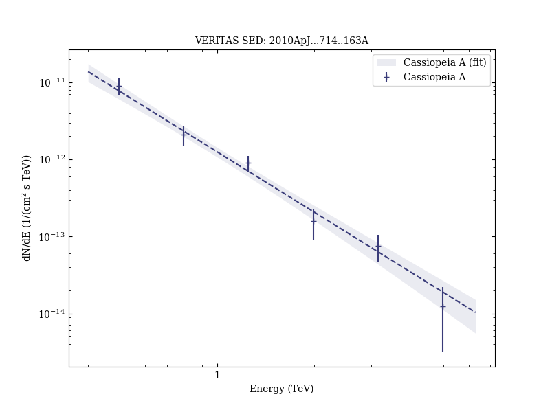

# Observations of the Shell-type Supernova Remnant Cassiopeia A at TeV Energies with VERITAS

Reference:
Acciari, V. A. et al. (The VERITAS Collaboration), The Astrophysical Journal, 714, 163 (2010)

- ADS: [2010ApJ...714..163A](http://adsabs.harvard.edu/abs/2010ApJ...714..163A)
- DOI: [10.1088/0004-637X/714/1/163](https://doi.org/10.1088/0004-637X/714/1/163)

## Cassiopeia A (VER J2323+588)
### Data files

- observation data: [VER-000153.yaml](VER-000153.yaml)
- spectral data: [VER-000153-sed.ecsv](VER-000153-sed.ecsv)
- observation data and fit results: [VER-000153.yaml](VER-000153.yaml)

### Figures

