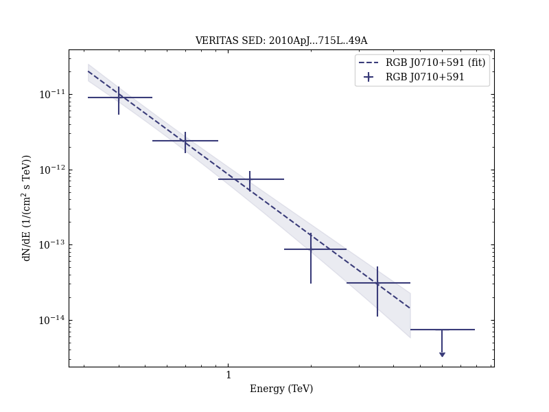

# The Discovery of γ-Ray Emission from the Blazar RGB J0710+591

Reference:
Acciari, V. A. et al. (The VERITAS Collaboration), The Astrophysical Journal, 715, L49 (2010)

- ADS: [2010ApJ...715L..49A](http://adsabs.harvard.edu/abs/2010ApJ...715L..49A)
- DOI: [10.1088/2041-8205/715/1/L49](https://doi.org/10.1088/2041-8205/715/1/L49)

## RGB J0710+591 (VER J0710+591)
### Data files

- observation data: [VER-000034.yaml](VER-000034.yaml)
- spectral data: [VER-000034-sed.ecsv](VER-000034-sed.ecsv)
- observation data and fit results: [VER-000034.yaml](VER-000034.yaml)

### Figures

