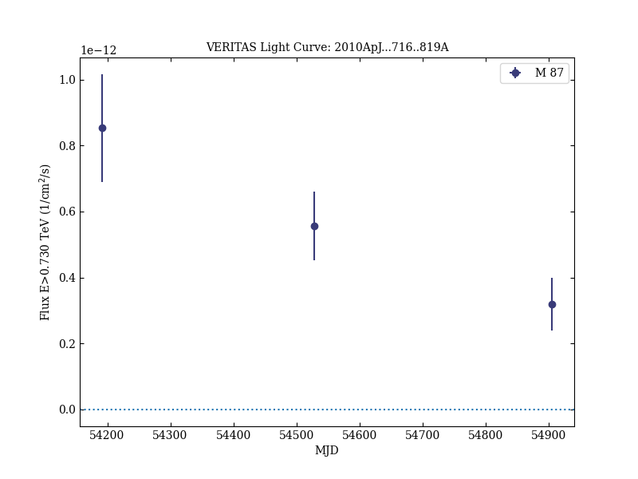
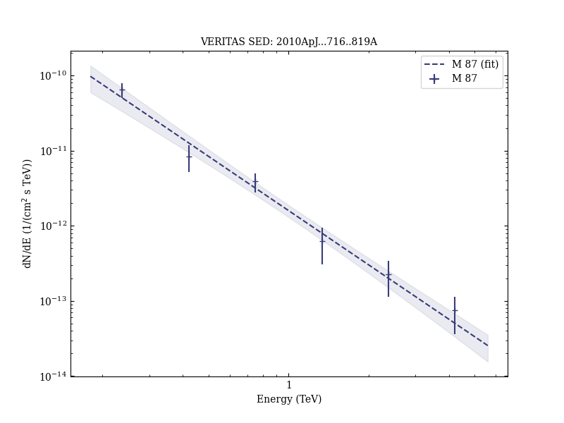
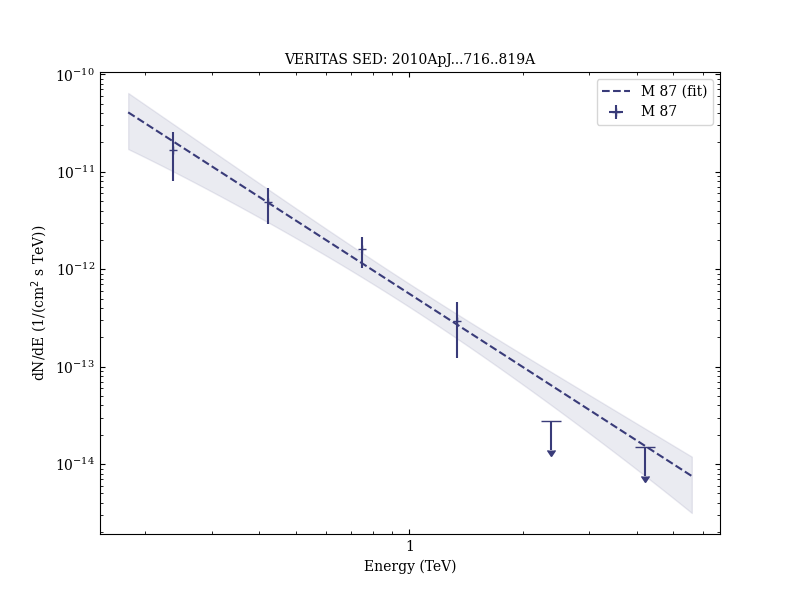

# Veritas 2008-2009 Monitoring of the Variable Gamma-ray Source M 87

Reference:
Acciari, V. A. et al. (The VERITAS Collaboration), The Astrophysical Journal, 716, 819 (2010)

- ADS: [2010ApJ...716..819A](http://adsabs.harvard.edu/abs/2010ApJ...716..819A)
- DOI: [10.1088/0004-637X/716/1/819](https://doi.org/10.1088/0004-637X/716/1/819)

## M 87 (VER J1230+123)
### Data files

- observation data: [VER-000058-1.yaml](VER-000058-1.yaml)  [VER-000058-2.yaml](VER-000058-2.yaml)  [VER-000058-3.yaml](VER-000058-3.yaml)  [VER-000058-4.yaml](VER-000058-4.yaml)
- spectral data: [VER-000058-sed-1.ecsv](VER-000058-sed-1.ecsv)  [VER-000058-sed-2.ecsv](VER-000058-sed-2.ecsv)  [VER-000058-sed-3.ecsv](VER-000058-sed-3.ecsv)
- light-curve data: [VER-000058-lc-1.ecsv](VER-000058-lc-1.ecsv)  [VER-000058-lc-2.ecsv](VER-000058-lc-2.ecsv)
- observation data and fit results: [VER-000058-1.yaml](VER-000058-1.yaml)  [VER-000058-2.yaml](VER-000058-2.yaml)  [VER-000058-3.yaml](VER-000058-3.yaml)  [VER-000058-4.yaml](VER-000058-4.yaml)

### Figures

