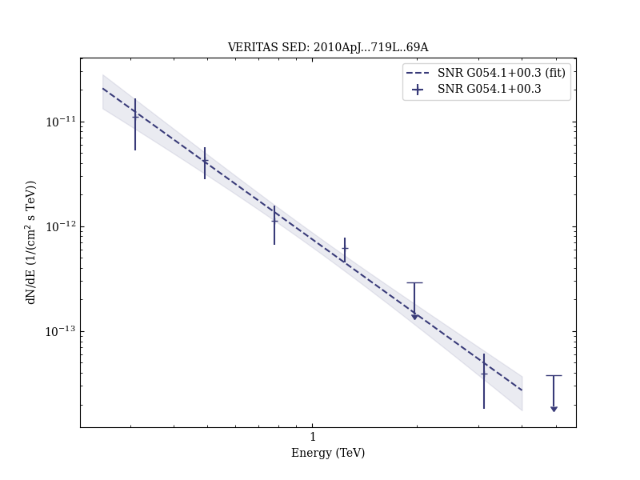

# Discovery of Very High Energy γ-ray Emission from the SNR G54.1+0.3

Reference:
Acciari, V. A. et al. (The VERITAS Collaboration), The Astrophysical Journal, 719, L69 (2010)

- ADS: [2010ApJ...719L..69A](http://adsabs.harvard.edu/abs/2010ApJ...719L..69A)
- DOI: [10.1088/2041-8205/719/1/L69](https://doi.org/10.1088/2041-8205/719/1/L69)

## SNR G054.1+00.3 (VER J1930+188)
### Data files

- observation data: [VER-000136.yaml](VER-000136.yaml)
- spectral data: [VER-000136-sed.ecsv](VER-000136-sed.ecsv)
- observation data and fit results: [VER-000136.yaml](VER-000136.yaml)

### Figures

