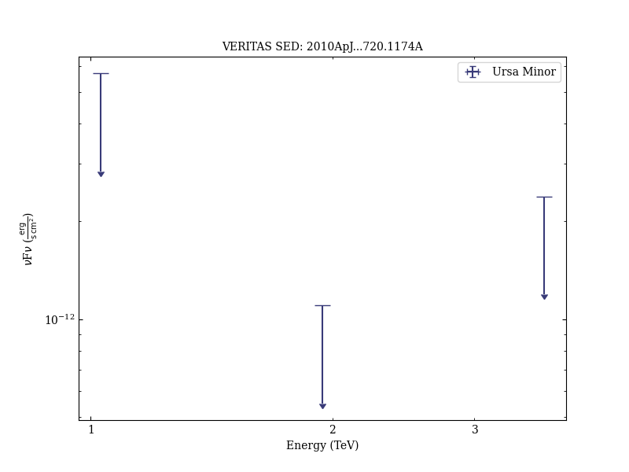
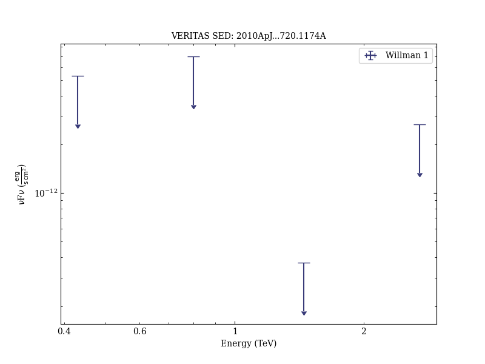

# VERITAS Search for VHE Gamma-ray Emission from Dwarf Spheroidal Galaxies

Reference:
Acciari, V. A. et al. (The VERITAS Collaboration), The Astrophysical Journal, 720, 1174 (2010)

- ADS: [2010ApJ...720.1174A](http://adsabs.harvard.edu/abs/2010ApJ...720.1174A)
- DOI: [10.1088/0004-637X/720/2/1174](https://doi.org/10.1088/0004-637X/720/2/1174)

## Draco
### Data files

- observation data: [VER-100174.yaml](VER-100174.yaml)
- spectral data: [VER-100174-sed.ecsv](VER-100174-sed.ecsv)
- observation data and fit results: [VER-100174.yaml](VER-100174.yaml)

### Figures

## Ursa Minor
### Data files

- observation data: [VER-100175.yaml](VER-100175.yaml)
- spectral data: [VER-100175-sed.ecsv](VER-100175-sed.ecsv)
- observation data and fit results: [VER-100175.yaml](VER-100175.yaml)

### Figures

## Bootes 1
### Data files

- observation data: [VER-100176.yaml](VER-100176.yaml)
- spectral data: [VER-100176-sed.ecsv](VER-100176-sed.ecsv)
- observation data and fit results: [VER-100176.yaml](VER-100176.yaml)

### Figures

## Willman 1
### Data files

- observation data: [VER-100177.yaml](VER-100177.yaml)
- spectral data: [VER-100177-sed.ecsv](VER-100177-sed.ecsv)
- observation data and fit results: [VER-100177.yaml](VER-100177.yaml)

### Figures

