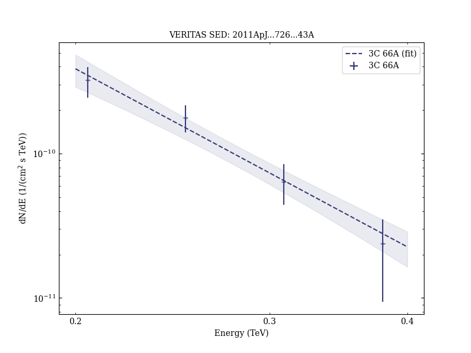

# Multi-wavelength Observations of the Flaring Gamma-ray Blazar 3C 66A in 2008 October

Reference:
Abdo, A. A. et al. (The VERITAS Collaboration), The Astrophysical Journal, 726, 43 (2011)

- ADS: [2011ApJ...726...43A](http://adsabs.harvard.edu/abs/2011ApJ...726...43A)
- DOI: [10.1088/0004-637X/726/1/43](https://doi.org/10.1088/0004-637X/726/1/43)

## 3C 66A (VER J0222+430)
### Data files

- observation data: [VER-000011-1.yaml](VER-000011-1.yaml)  [VER-000011-2.yaml](VER-000011-2.yaml)
- spectral data: [VER-000011-sed-1.ecsv](VER-000011-sed-1.ecsv)  [VER-000011-sed-2.ecsv](VER-000011-sed-2.ecsv)
- light-curve data: [VER-000011-lc-1.ecsv](VER-000011-lc-1.ecsv)  [VER-000011-lc-2.ecsv](VER-000011-lc-2.ecsv)
- observation data and fit results: [VER-000011-1.yaml](VER-000011-1.yaml)  [VER-000011-2.yaml](VER-000011-2.yaml)

### Figures

