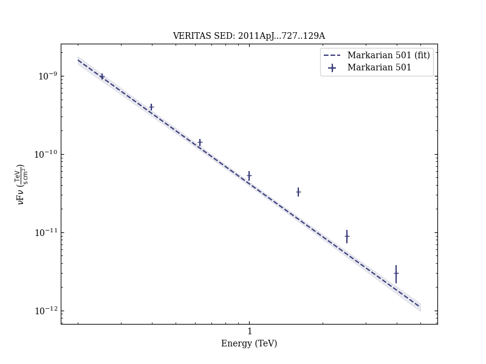
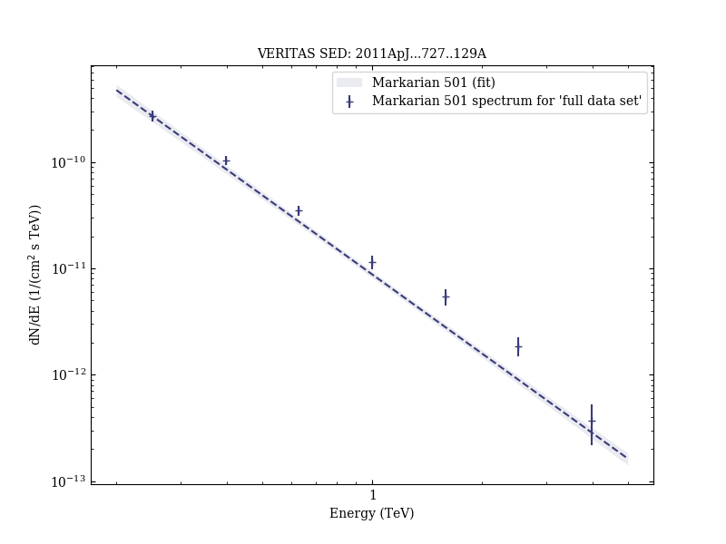

# Insights into the High-energy γ-ray Emission of Markarian 501 from Extensive Multifrequency Observations in the Fermi Era

Reference:
Abdo, A. A. et al. (The VERITAS and MAGIC Collaborations), The Astrophysical Journal, 727, 129 (2011)

- ADS: [2011ApJ...727..129A](http://adsabs.harvard.edu/abs/2011ApJ...727..129A)
- DOI: [10.1088/0004-637X/727/2/129](https://doi.org/10.1088/0004-637X/727/2/129)

## Markarian 501 (VER J1653+397)
### Data files

- observation data: [VER-000091-1.yaml](VER-000091-1.yaml)  [VER-000091-2.yaml](VER-000091-2.yaml)  
- spectral data: [VER-000091-sed-1.ecsv](VER-000091-sed-1.ecsv)  [VER-000091-sed-2.ecsv](VER-000091-sed-2.ecsv)  
- observation data and fit results: [VER-000091-1.yaml](VER-000091-1.yaml)  [VER-000091-2.yaml](VER-000091-2.yaml)  

### Figures

