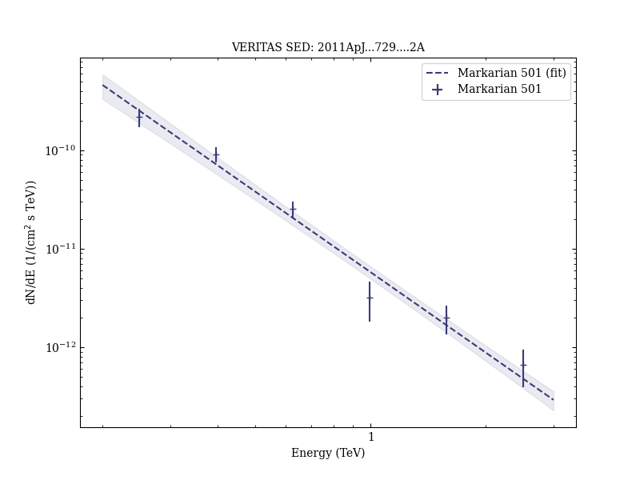

# Spectral Energy Distribution of Markarian 501: Quiescent State Versus Extreme Outburst

Reference:
Acciari, V. A. et al. (The VERITAS Collaboration), The Astrophysical Journal, 729, 2 (2011)

- ADS: [2011ApJ...729....2A](http://adsabs.harvard.edu/abs/2011ApJ...729....2A)
- DOI: [10.1088/0004-637X/729/1/2](https://doi.org/10.1088/0004-637X/729/1/2)

## Markarian 501 (VER J1653+397)
### Data files

- observation data: [VER-000091-2.yaml](VER-000091-2.yaml)
- spectral data: [VER-000091-sed-2.ecsv](VER-000091-sed-2.ecsv)
- light-curve data: [VER-000091-lc-2.ecsv](VER-000091-lc-2.ecsv)
- observation data and fit results: [VER-000091-2.yaml](VER-000091-2.yaml)

### Figures

