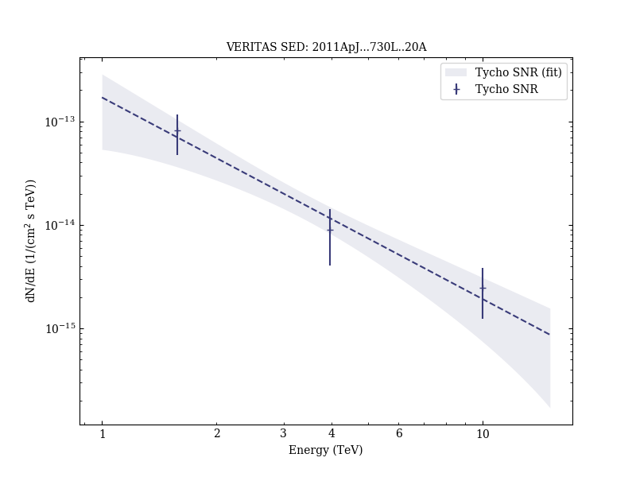

# Discovery of TeV Gamma-ray Emission from Tycho's Supernova Remnant

Reference:
Acciari, V. A. et al. (The VERITAS Collaboration), The Astrophysical Journal, 730, L20 (2011)

- ADS: [2011ApJ...730L..20A](http://adsabs.harvard.edu/abs/2011ApJ...730L..20A)
- DOI: [10.1088/2041-8205/730/2/L20](https://doi.org/10.1088/2041-8205/730/2/L20)

## Tycho SNR (VER J0025+641)
### Data files

- observation data: [VER-000003.yaml](VER-000003.yaml)  
- spectral data: [VER-000003-sed.ecsv](VER-000003-sed.ecsv)  
- observation data and fit results: [VER-000003.yaml](VER-000003.yaml)  

### Figures

