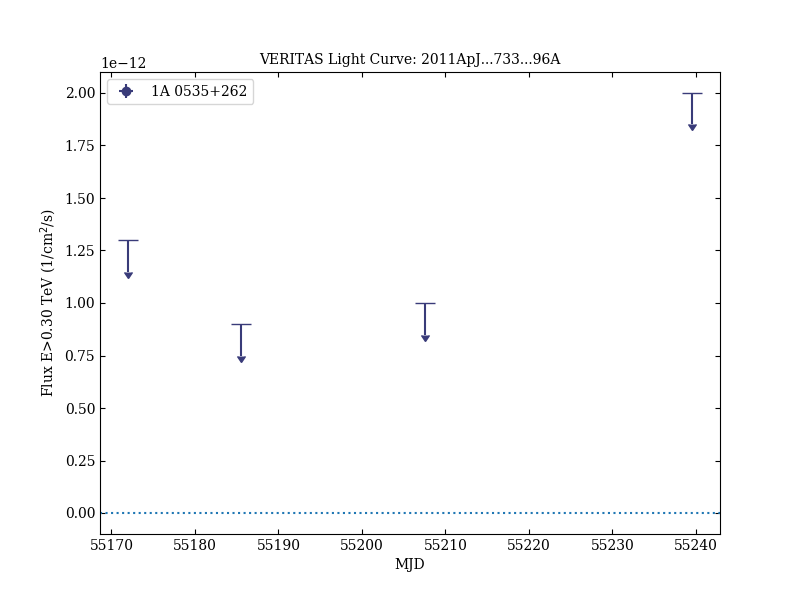

# Gamma-Ray Observations of the Be/Pulsar Binary 1A 0535+262 During a Giant X-Ray Outburst

Reference:
Acciari, V. A. et al. (The VERITAS Collaboration), The Astrophysical Journal, 733, 96 (2011)

- ADS: [2011ApJ...733...96A](http://adsabs.harvard.edu/abs/2011ApJ...733...96A)
- DOI: [10.1088/0004-637X/733/2/96](https://doi.org/10.1088/0004-637X/733/2/96)

## 1A 0535+262
### Data files

- observation data: [VER-100189.yaml](VER-100189.yaml)
- light-curve data: [VER-100189-lc-1.ecsv](VER-100189-lc-1.ecsv)
- observation data and fit results: [VER-100189.yaml](VER-100189.yaml)

### Figures

