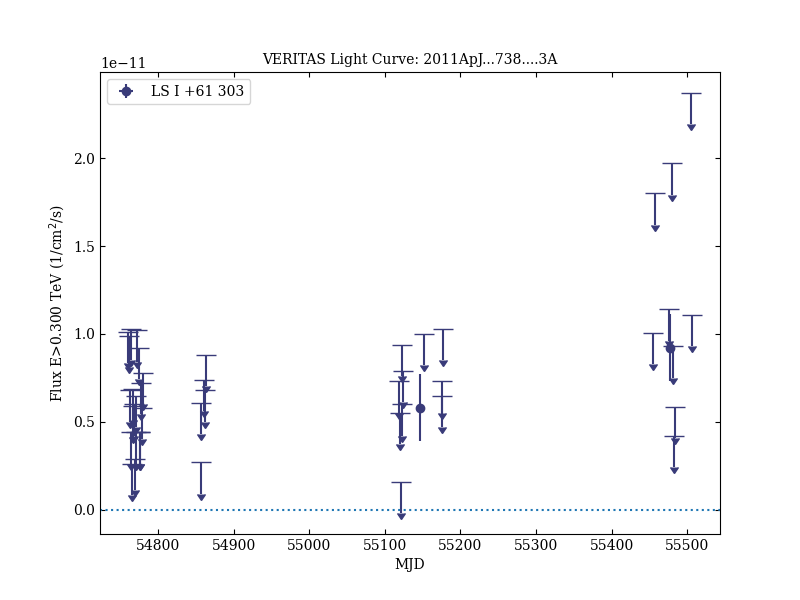

# VERITAS Observations of the TeV Binary LS I +61° 303 During 2008-2010

Reference:
Acciari, V. A. et al. (The VERITAS Collaboration), The Astrophysical Journal, 738, 3 (2011)

- ADS: [2011ApJ...738....3A](http://adsabs.harvard.edu/abs/2011ApJ...738....3A)
- DOI: [10.1088/0004-637X/738/1/3](https://doi.org/10.1088/0004-637X/738/1/3)

## LS I +61 303 (VER J0240+612)
### Data files

- observation data: [VER-000014.yaml](VER-000014.yaml)  
- light-curve data: [VER-000014-lc.ecsv](VER-000014-lc.ecsv)  
- observation data and fit results: [VER-000014.yaml](VER-000014.yaml)  

### Figures

