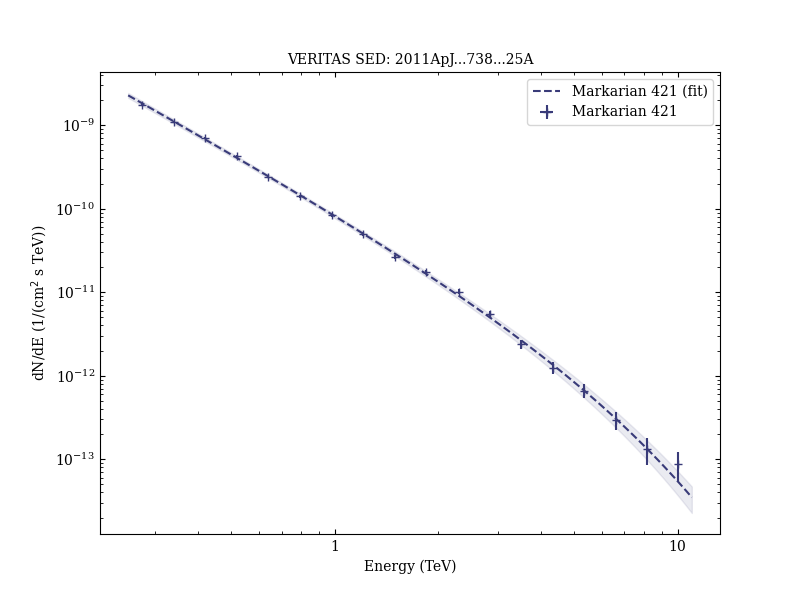
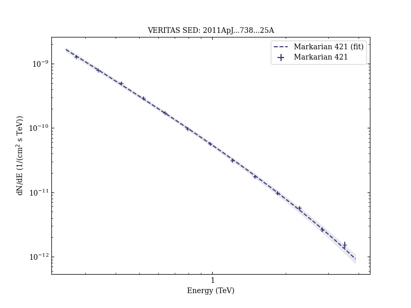
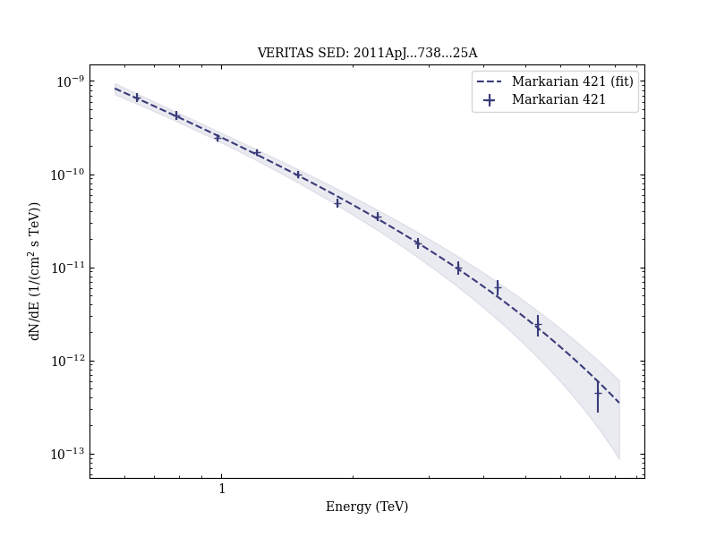
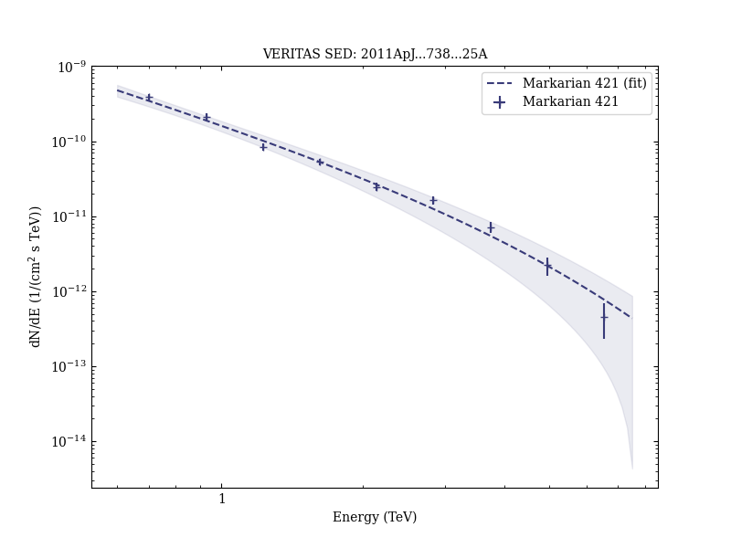
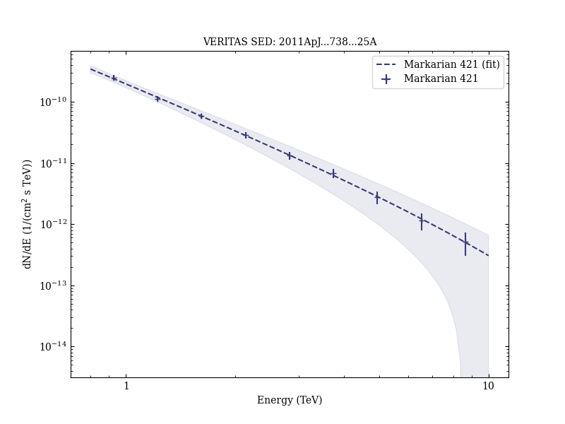

# TeV and Multi-wavelength Observations of Mrk 421 in 2006-2008

Reference:
Acciari, V. A. et al. (The VERITAS Collaboration), The Astrophysical Journal, 738, 25 (2011)

- ADS: [2011ApJ...738...25A](http://adsabs.harvard.edu/abs/2011ApJ...738...25A)
- DOI: [10.1088/0004-637X/738/1/25](https://doi.org/10.1088/0004-637X/738/1/25)

## Markarian 421
### Data files

- observation data: [VER-000049-1.yaml](VER-000049-1.yaml)  [VER-000049-2.yaml](VER-000049-2.yaml)  [VER-000049-3.yaml](VER-000049-3.yaml)  [VER-000049-4.yaml](VER-000049-4.yaml)  [VER-000049-5.yaml](VER-000049-5.yaml)  [VER-000049-6.yaml](VER-000049-6.yaml)  [VER-000049-7.yaml](VER-000049-7.yaml)  
- spectral data: [VER-000049-sed-1.ecsv](VER-000049-sed-1.ecsv)  [VER-000049-sed-2.ecsv](VER-000049-sed-2.ecsv)  [VER-000049-sed-3.ecsv](VER-000049-sed-3.ecsv)  [VER-000049-sed-4.ecsv](VER-000049-sed-4.ecsv)  [VER-000049-sed-5.ecsv](VER-000049-sed-5.ecsv)  [VER-000049-sed-6.ecsv](VER-000049-sed-6.ecsv)  [VER-000049-sed-7.ecsv](VER-000049-sed-7.ecsv)  
- observation data and fit results: [VER-000049-1.yaml](VER-000049-1.yaml)  [VER-000049-2.yaml](VER-000049-2.yaml)  [VER-000049-3.yaml](VER-000049-3.yaml)  [VER-000049-4.yaml](VER-000049-4.yaml)  [VER-000049-5.yaml](VER-000049-5.yaml)  [VER-000049-6.yaml](VER-000049-6.yaml)  [VER-000049-7.yaml](VER-000049-7.yaml)  

### Figures

