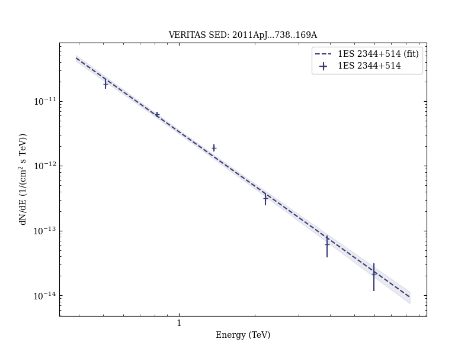

# Multiwavelength Observations of the Very High Energy Blazar 1ES 2344+514

Reference:
Acciari, V. A. et al. (The VERITAS Collaboration), The Astrophysical Journal, 738, 169 (2011)

- ADS: [2011ApJ...738..169A](http://adsabs.harvard.edu/abs/2011ApJ...738..169A)
- DOI: [10.1088/0004-637X/738/2/169](https://doi.org/10.1088/0004-637X/738/2/169)

## 1ES 2344+514 (VER J2347+517)
### Data files

- observation data: [VER-000154-1.yaml](VER-000154-1.yaml)  [VER-000154-2.yaml](VER-000154-2.yaml)  
- spectral data: [VER-000154-sed-1.ecsv](VER-000154-sed-1.ecsv)  [VER-000154-sed-2.ecsv](VER-000154-sed-2.ecsv)  
- light-curve data: [VER-000154-lc-1.ecsv](VER-000154-lc-1.ecsv)  
- observation data and fit results: [VER-000154-1.yaml](VER-000154-1.yaml)  [VER-000154-2.yaml](VER-000154-2.yaml)  

### Figures

