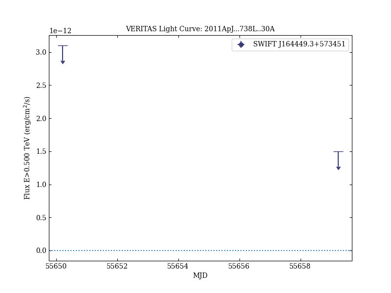

# VERITAS Observations of the Unusual Extragalactic Transient Swift J164449.3+573451

Reference:
Aliu, E. et al. (The VERITAS Collaboration), The Astrophysical Journal, 738, L30 (2011)

- ADS: [2011ApJ...738L..30A](http://adsabs.harvard.edu/abs/2011ApJ...738L..30A)
- DOI: [10.1088/2041-8205/738/2/L30](https://doi.org/10.1088/2041-8205/738/2/L30)

## SWIFT J164449.3+573451
### Data files

- light-curve data: [VER-100190-lc-1.ecsv](VER-100190-lc-1.ecsv)  [VER-100190-lc-2.ecsv](VER-100190-lc-2.ecsv)  [VER-100190-lc-3.ecsv](VER-100190-lc-3.ecsv)  

### Figures

