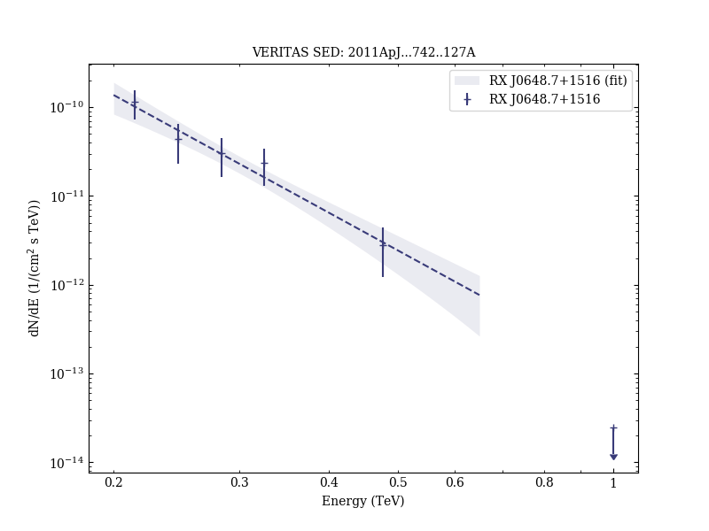

# Multiwavelength Observations of the Previously Unidentified Blazar RX J0648.7+1516

Reference:
Aliu, E. et al. (The VERITAS Collaboration), The Astrophysical Journal, 742, 127 (2011)

- ADS: [2011ApJ...742..127A](http://adsabs.harvard.edu/abs/2011ApJ...742..127A)
- DOI: [10.1088/0004-637X/742/2/127](https://doi.org/10.1088/0004-637X/742/2/127)

## RX J0648.7+1516 (VER J0648+152)
### Data files

- observation data: [VER-000032.yaml](VER-000032.yaml)  
- spectral data: [VER-000032-sed.ecsv](VER-000032-sed.ecsv)  
- observation data and fit results: [VER-000032.yaml](VER-000032.yaml)  

### Figures

