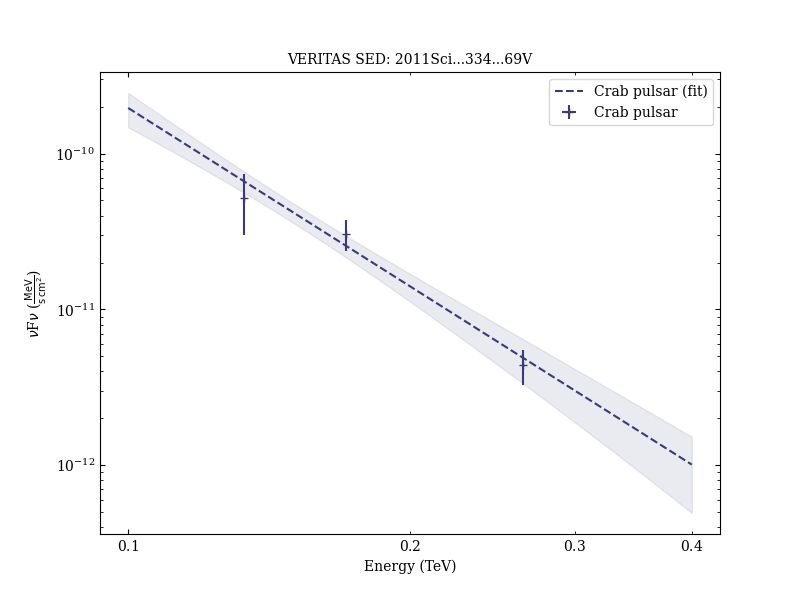

# Detection of Pulsed Gamma Rays Above 100 GeV from the Crab Pulsar

Reference:
VERITAS Collaboration et al. (The VERITAS Collaboration), Science, 334, 69 (2011)

- ADS: [2011Sci...334...69V](http://adsabs.harvard.edu/abs/2011Sci...334...69V)
- DOI: [10.1126/science.1208192](https://doi.org/10.1126/science.1208192)

## Crab pulsar
### Data files

- observation data: [VER-000166.yaml](VER-000166.yaml)  
- spectral data: [VER-000166-sed.ecsv](VER-000166-sed.ecsv)  
- observation data and fit results: [VER-000166.yaml](VER-000166.yaml)  

### Figures

