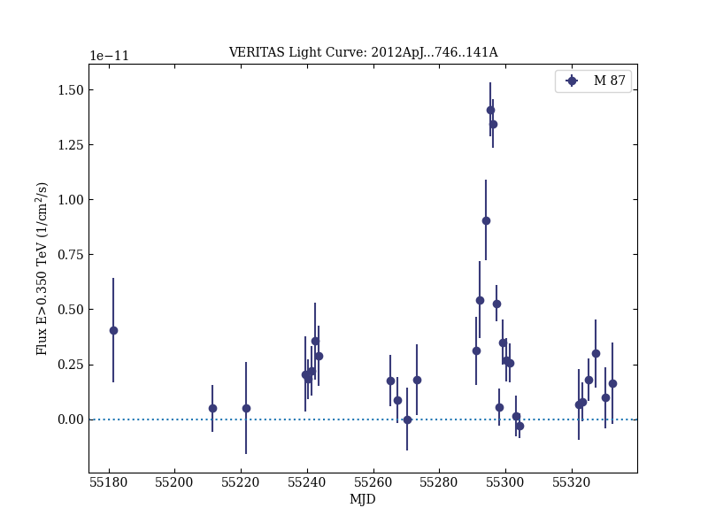
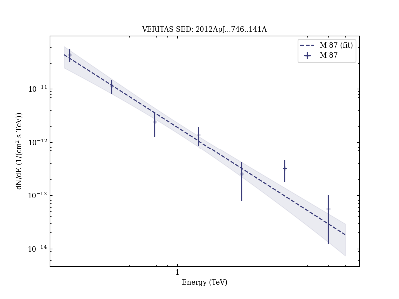
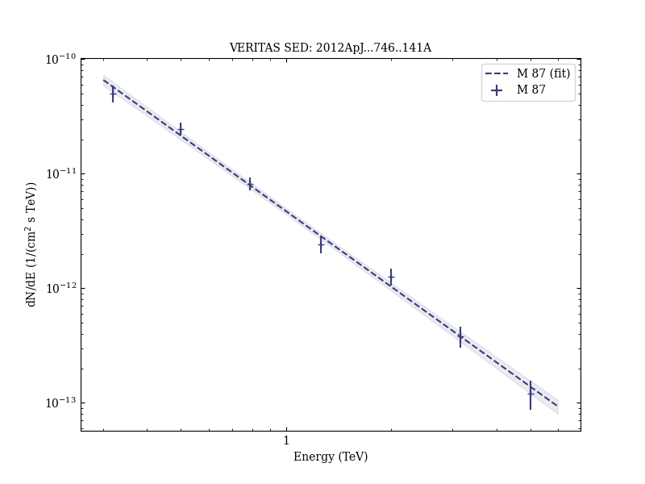

# VERITAS Observations of Day-scale Flaring of M 87 in 2010 April

Reference:
Aliu, E. et al. (The VERITAS Collaboration), The Astrophysical Journal, 746, 141 (2012)

- ADS: [2012ApJ...746..141A](http://adsabs.harvard.edu/abs/2012ApJ...746..141A)
- DOI: [10.1088/0004-637X/746/2/141](https://doi.org/10.1088/0004-637X/746/2/141)

## M 87 (VER J1230+123)
### Data files

- observation data: [VER-000058-1.yaml](VER-000058-1.yaml)  [VER-000058-2.yaml](VER-000058-2.yaml)  [VER-000058-3.yaml](VER-000058-3.yaml)
- spectral data: [VER-000058-sed-1.ecsv](VER-000058-sed-1.ecsv)  [VER-000058-sed-2.ecsv](VER-000058-sed-2.ecsv)  [VER-000058-sed-3.ecsv](VER-000058-sed-3.ecsv)
- light-curve data: [VER-000058-lc-1.ecsv](VER-000058-lc-1.ecsv)  [VER-000058-lc-2.ecsv](VER-000058-lc-2.ecsv)  [VER-000058-lc-3.ecsv](VER-000058-lc-3.ecsv)  [VER-000058-lc-4.ecsv](VER-000058-lc-4.ecsv)  [VER-000058-lc-5.ecsv](VER-000058-lc-5.ecsv)  [VER-000058-lc-6.ecsv](VER-000058-lc-6.ecsv)  [VER-000058-lc-7.ecsv](VER-000058-lc-7.ecsv)
- observation data and fit results: [VER-000058-1.yaml](VER-000058-1.yaml)  [VER-000058-2.yaml](VER-000058-2.yaml)  [VER-000058-3.yaml](VER-000058-3.yaml)

### Figures

