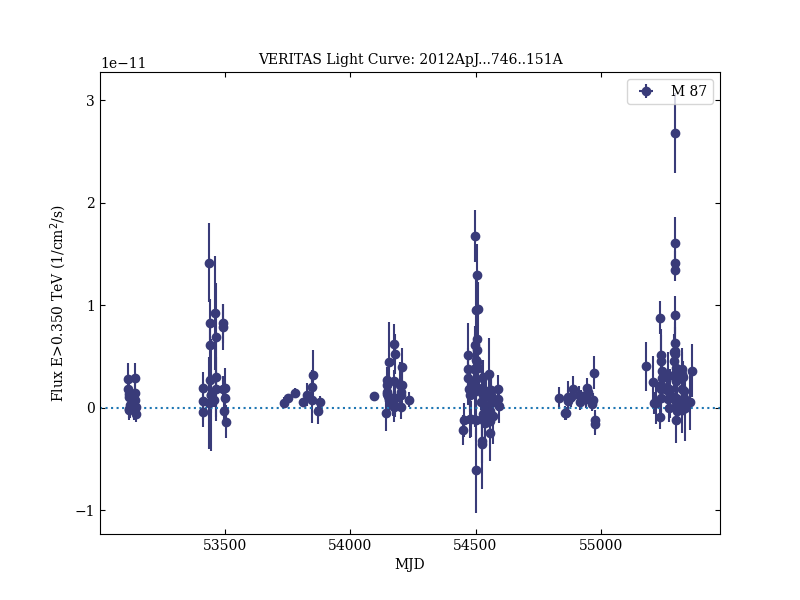

# The 2010 Very High Energy γ-Ray Flare and 10 Years of Multi-wavelength Observations of M 87

Reference:
Abramowski, A. et al., The Astrophysical Journal, 746, 151 (2012)

- ADS: [2012ApJ...746..151A](http://adsabs.harvard.edu/abs/2012ApJ...746..151A)
- DOI: [10.1088/0004-637X/746/2/151](https://doi.org/10.1088/0004-637X/746/2/151)

## M 87 (VER J1230+123)
### Data files

- observation data: [VER-000058.yaml](VER-000058.yaml)
- light-curve data: [VER-000058-lc.ecsv](VER-000058-lc.ecsv)
- observation data and fit results: [VER-000058.yaml](VER-000058.yaml)

### Figures

