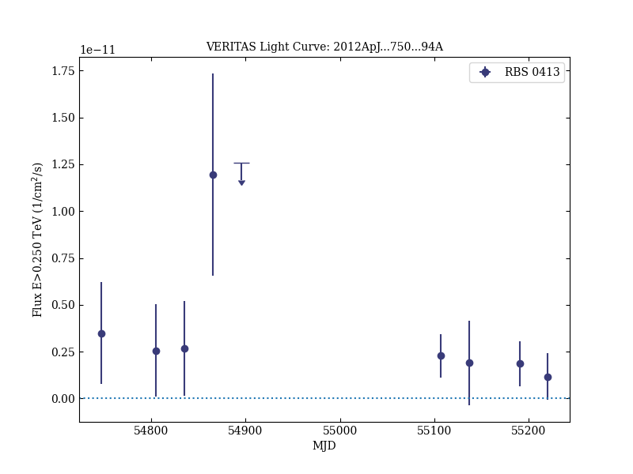
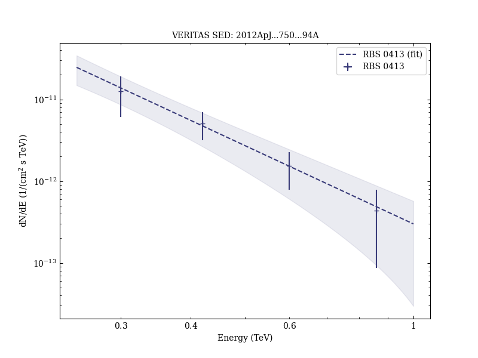

# Discovery of High-energy and Very High Energy γ-Ray Emission from the Blazar RBS 0413

Reference:
Aliu, E. et al. (The VERITAS Collaboration), The Astrophysical Journal, 750, 94 (2012)

- ADS: [2012ApJ...750...94A](http://adsabs.harvard.edu/abs/2012ApJ...750...94A)
- DOI: [10.1088/0004-637X/750/2/94](https://doi.org/10.1088/0004-637X/750/2/94)

## RBS 0413 (VER J0319+187)
### Data files

- observation data: [VER-000017.yaml](VER-000017.yaml)
- spectral data: [VER-000017-sed.ecsv](VER-000017-sed.ecsv)
- light-curve data: [VER-000017-lc.ecsv](VER-000017-lc.ecsv)
- observation data and fit results: [VER-000017.yaml](VER-000017.yaml)

### Figures

