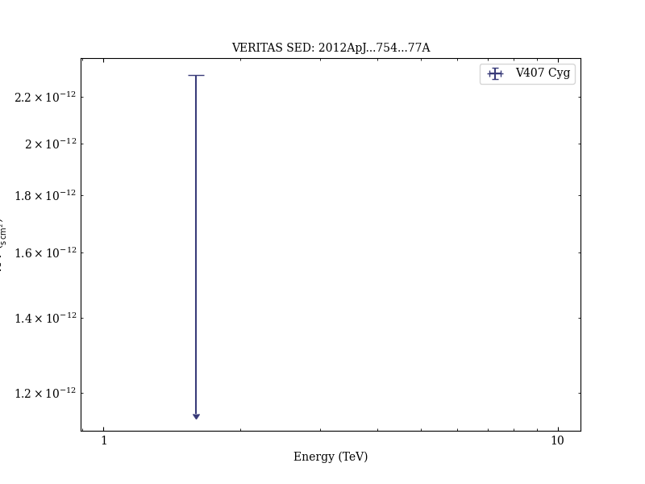

# VERITAS Observations of the Nova in V407 Cygni

Reference:
Aliu, E. et al. (The VERITAS Collaboration), The Astrophysical Journal, 754, 77 (2012)

- ADS: [2012ApJ...754...77A](http://adsabs.harvard.edu/abs/2012ApJ...754...77A)
- DOI: [10.1088/0004-637X/754/1/77](https://doi.org/10.1088/0004-637X/754/1/77)

## V407 Cyg
### Data files

- spectral data: [VER-100183-sed-1.ecsv](VER-100183-sed-1.ecsv)  

### Figures

