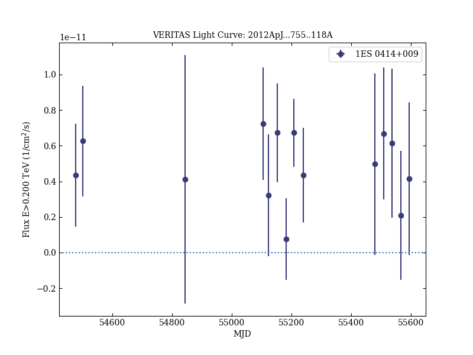

# Multiwavelength Observations of the AGN 1ES 0414+009 with VERITAS, Fermi-LAT, Swift-XRT, and MDM

Reference:
Aliu, E. et al. (The VERITAS Collaboration), The Astrophysical Journal, 755, 118 (2012)

- ADS: [2012ApJ...755..118A](http://adsabs.harvard.edu/abs/2012ApJ...755..118A)
- DOI: [10.1088/0004-637X/755/2/118](https://doi.org/10.1088/0004-637X/755/2/118)

## 1ES 0414+009 (VER J0416+011)
### Data files

- observation data: [VER-000020.yaml](VER-000020.yaml)  
- spectral data: [VER-000020-sed.ecsv](VER-000020-sed.ecsv)  
- light-curve data: [VER-000020-lc.ecsv](VER-000020-lc.ecsv)  
- observation data and fit results: [VER-000020.yaml](VER-000020.yaml)  

### Figures

