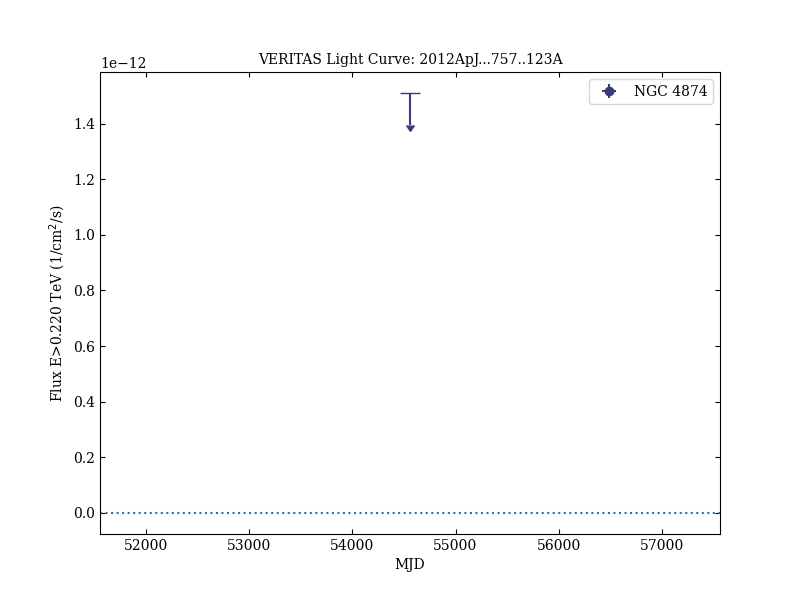

# Constraints on Cosmic Rays, Magnetic Fields, and Dark Matter from Gamma-Ray Observations of the Coma Cluster of Galaxies with VERITAS and Fermi

Reference:
Arlen, T. et al. (The VERITAS Collaboration), The Astrophysical Journal, 757, 123 (2012)

- ADS: [2012ApJ...757..123A](http://adsabs.harvard.edu/abs/2012ApJ...757..123A)
- DOI: [10.1088/0004-637X/757/2/123](https://doi.org/10.1088/0004-637X/757/2/123)

## Coma Cluster
### Data files

- observation data: [VER-100184.yaml](VER-100184.yaml)
- light-curve data: [VER-100184-lc-1.ecsv](VER-100184-lc-1.ecsv)
- observation data and fit results: [VER-100184.yaml](VER-100184.yaml)

### Figures

## NGC 4889
### Data files

- observation data: [VER-100185.yaml](VER-100185.yaml)
- light-curve data: [VER-100185-lc-1.ecsv](VER-100185-lc-1.ecsv)
- observation data and fit results: [VER-100185.yaml](VER-100185.yaml)

### Figures

## NGC 4874
### Data files

- observation data: [VER-100186.yaml](VER-100186.yaml)
- light-curve data: [VER-100186-lc-1.ecsv](VER-100186-lc-1.ecsv)
- observation data and fit results: [VER-100186.yaml](VER-100186.yaml)

### Figures

## NGC 4921
### Data files

- observation data: [VER-100187.yaml](VER-100187.yaml)
- light-curve data: [VER-100187-lc-1.ecsv](VER-100187-lc-1.ecsv)
- observation data and fit results: [VER-100187.yaml](VER-100187.yaml)

### Figures

