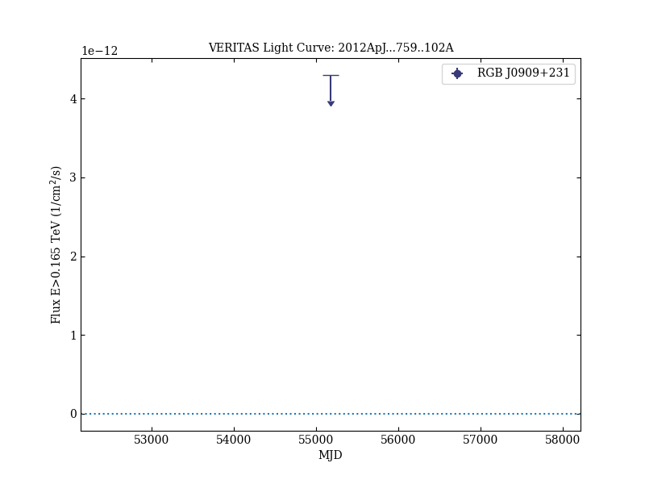
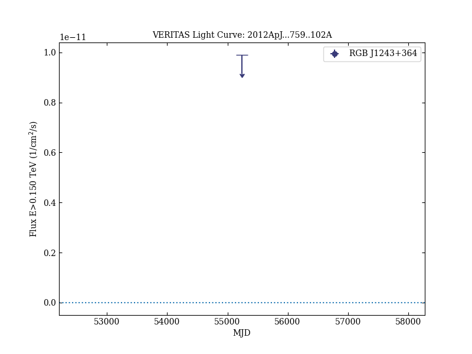
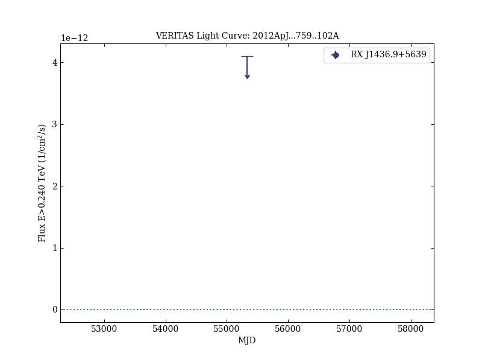

# VERITAS Observations of Six Bright, Hard-spectrum Fermi-LAT Blazars

Reference:
Aliu, E. et al. (The VERITAS Collaboration), The Astrophysical Journal, 759, 102 (2012)

- ADS: [2012ApJ...759..102A](http://adsabs.harvard.edu/abs/2012ApJ...759..102A)
- DOI: [10.1088/0004-637X/759/2/102](https://doi.org/10.1088/0004-637X/759/2/102)

## RGB J0136+391
### Data files

- observation data: [VER-000007.yaml](VER-000007.yaml)  
- spectral data: [VER-000007-sed-1.ecsv](VER-000007-sed-1.ecsv)  
- light-curve data: [VER-000007-lc-1.ecsv](VER-000007-lc-1.ecsv)  
- observation data and fit results: [VER-000007.yaml](VER-000007.yaml)  

### Figures

## RGB J0316+090
### Data files

- observation data: [VER-100191.yaml](VER-100191.yaml)  
- spectral data: [VER-100191-sed-1.ecsv](VER-100191-sed-1.ecsv)  
- light-curve data: [VER-100191-lc-1.ecsv](VER-100191-lc-1.ecsv)  
- observation data and fit results: [VER-100191.yaml](VER-100191.yaml)  

### Figures

## RGB J0909+231
### Data files

- observation data: [VER-100192.yaml](VER-100192.yaml)  
- spectral data: [VER-100192-sed-1.ecsv](VER-100192-sed-1.ecsv)  
- light-curve data: [VER-100192-lc-1.ecsv](VER-100192-lc-1.ecsv)  
- observation data and fit results: [VER-100192.yaml](VER-100192.yaml)  

### Figures

## RGB J1058+564
### Data files

- observation data: [VER-100193.yaml](VER-100193.yaml)  
- spectral data: [VER-100193-sed-1.ecsv](VER-100193-sed-1.ecsv)  
- light-curve data: [VER-100193-lc-1.ecsv](VER-100193-lc-1.ecsv)  
- observation data and fit results: [VER-100193.yaml](VER-100193.yaml)  

### Figures

## RGB J1243+364
### Data files

- observation data: [VER-100194.yaml](VER-100194.yaml)  
- spectral data: [VER-100194-sed-1.ecsv](VER-100194-sed-1.ecsv)  
- light-curve data: [VER-100194-lc-1.ecsv](VER-100194-lc-1.ecsv)  
- observation data and fit results: [VER-100194.yaml](VER-100194.yaml)  

### Figures

## RX J1436.9+5639
### Data files

- observation data: [VER-100195.yaml](VER-100195.yaml)  
- spectral data: [VER-100195-sed-1.ecsv](VER-100195-sed-1.ecsv)  
- light-curve data: [VER-100195-lc-1.ecsv](VER-100195-lc-1.ecsv)  
- observation data and fit results: [VER-100195.yaml](VER-100195.yaml)  

### Figures

