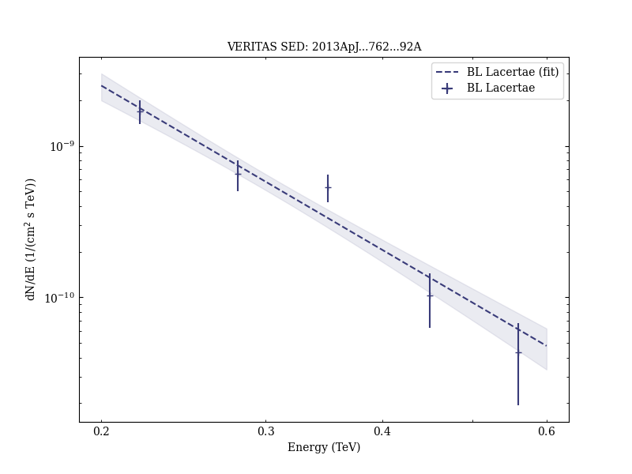
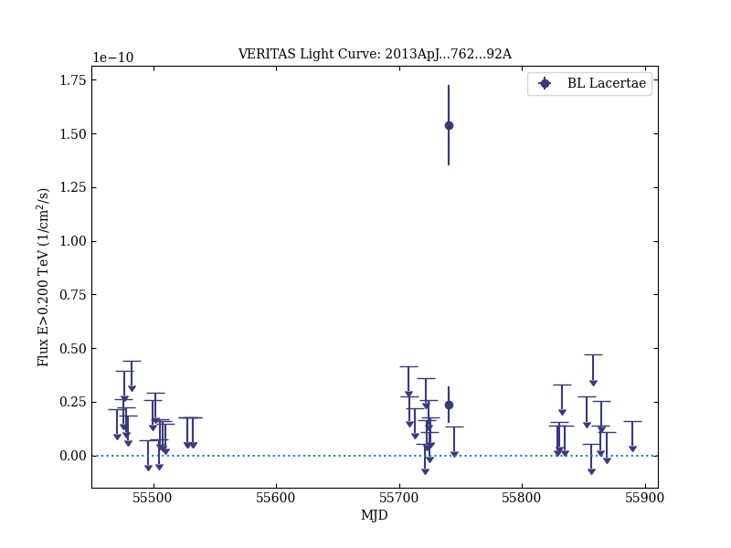

# Rapid TeV Gamma-Ray Flaring of BL Lacertae

Reference:
Arlen, T. et al. (The VERITAS Collaboration), The Astrophysical Journal, 762, 92 (2013)

- ADS: [2013ApJ...762...92A](http://adsabs.harvard.edu/abs/2013ApJ...762...92A)
- DOI: [10.1088/0004-637X/762/2/92](https://doi.org/10.1088/0004-637X/762/2/92)

## BL Lacertae (VER J2202+422)
### Data files

- observation data: [VER-000148.yaml](VER-000148.yaml)
- spectral data: [VER-000148-sed.ecsv](VER-000148-sed.ecsv)
- light-curve data: [VER-000148-lc-1.ecsv](VER-000148-lc-1.ecsv)  [VER-000148-lc-2.ecsv](VER-000148-lc-2.ecsv)
- observation data and fit results: [VER-000148.yaml](VER-000148.yaml)

### Figures

