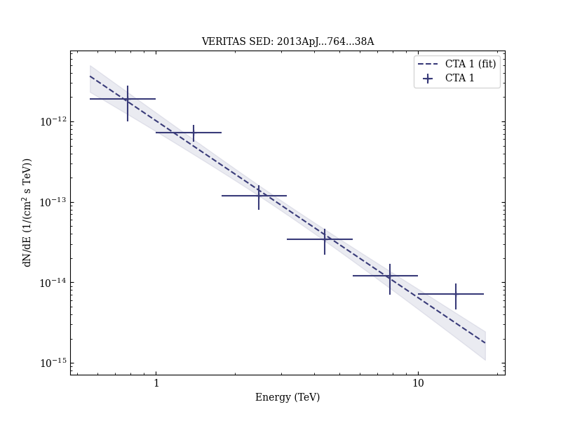

# Discovery of TeV Gamma-Ray Emission from CTA 1 by VERITAS

Reference:
Aliu, E. et al. (The VERITAS Collaboration), The Astrophysical Journal, 764, 38 (2013)

- ADS: [2013ApJ...764...38A](http://adsabs.harvard.edu/abs/2013ApJ...764...38A)
- DOI: [10.1088/0004-637X/764/1/38](https://doi.org/10.1088/0004-637X/764/1/38)

## CTA 1 (VER J0006+729)
### Data files

- observation data: [VER-000001.yaml](VER-000001.yaml)
- spectral data: [VER-000001-sed.ecsv](VER-000001-sed.ecsv)
- observation data and fit results: [VER-000001.yaml](VER-000001.yaml)

### Figures

