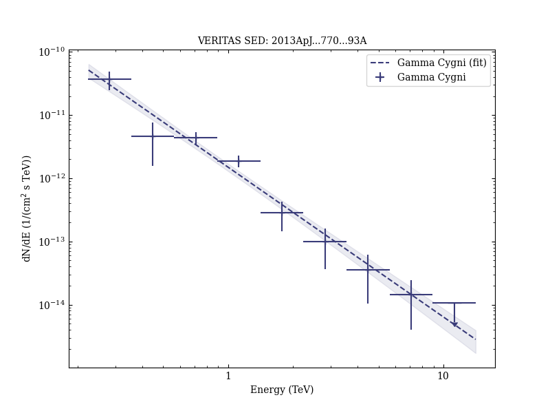

# Discovery of TeV Gamma-Ray Emission toward Supernova Remnant SNR G78.2+2.1

Reference:
Aliu, E. et al. (The VERITAS Collaboration), The Astrophysical Journal, 770, 93 (2013)

- ADS: [2013ApJ...770...93A](http://adsabs.harvard.edu/abs/2013ApJ...770...93A)
- DOI: [10.1088/0004-637X/770/2/93](https://doi.org/10.1088/0004-637X/770/2/93)

## Gamma Cygni (VER J2019+407)
### Data files

- observation data: [VER-000144.yaml](VER-000144.yaml)  
- spectral data: [VER-000144-sed.ecsv](VER-000144-sed.ecsv)  
- observation data and fit results: [VER-000144.yaml](VER-000144.yaml)  

### Figures

