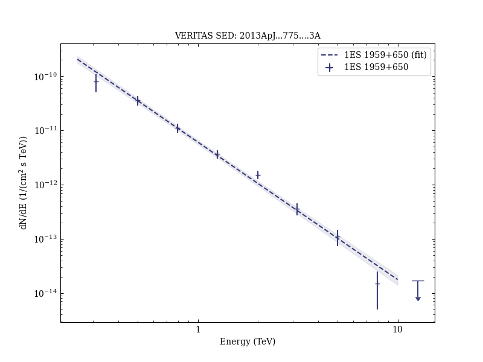

# Multiwavelength Observations and Modeling of 1ES 1959+650 in a Low Flux State

Reference:
Aliu, E. et al. (The VERITAS Collaboration), The Astrophysical Journal, 775, 3 (2013)

- ADS: [2013ApJ...775....3A](http://adsabs.harvard.edu/abs/2013ApJ...775....3A)
- DOI: [10.1088/0004-637X/775/1/3](https://doi.org/10.1088/0004-637X/775/1/3)

## 1ES 1959+650 (VER J1959+651)
### Data files

- observation data: [VER-000138.yaml](VER-000138.yaml)
- spectral data: [VER-000138-sed.ecsv](VER-000138-sed.ecsv)
- light-curve data: [VER-000138-lc.ecsv](VER-000138-lc.ecsv)
- observation data and fit results: [VER-000138.yaml](VER-000138.yaml)

### Figures

