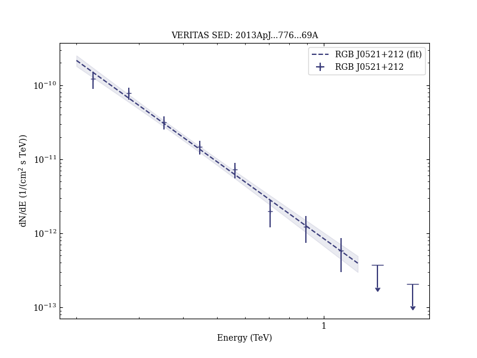
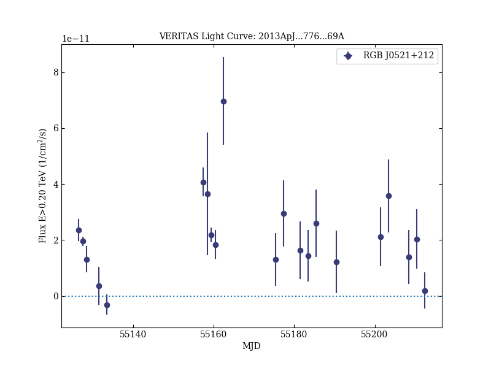

# Discovery of a New TeV Gamma-Ray Source: VER J0521+211

Reference:
Archambault, S. et al. (The VERITAS Collaboration), The Astrophysical Journal, 776, 69 (2013)

- ADS: [2013ApJ...776...69A](http://adsabs.harvard.edu/abs/2013ApJ...776...69A)
- DOI: [10.1088/0004-637X/776/2/69](https://doi.org/10.1088/0004-637X/776/2/69)

## RGB J0521+212 (VER J0521+211)
### Data files

- observation data: [VER-000023.yaml](VER-000023.yaml)  
- spectral data: [VER-000023-sed.ecsv](VER-000023-sed.ecsv)  
- light-curve data: [VER-000023-lc.ecsv](VER-000023-lc.ecsv)  
- observation data and fit results: [VER-000023.yaml](VER-000023.yaml)  

### Figures

