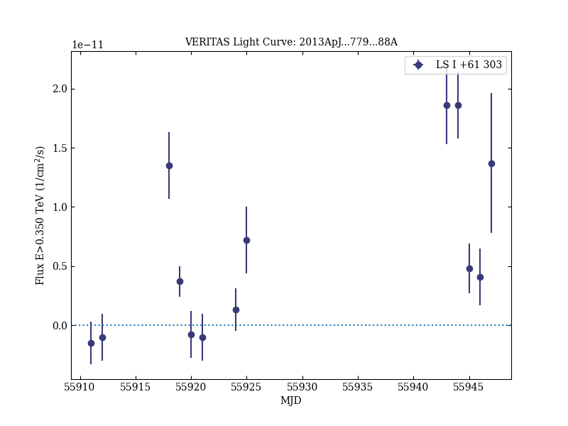

# Multiwavelength Observations of the TeV Binary LS I +61° 303 with VERITAS, Fermi-LAT, and Swift/XRT during a TeV Outburst

Reference:
Aliu, E. et al. (The VERITAS Collaboration), The Astrophysical Journal, 779, 88 (2013)

- ADS: [2013ApJ...779...88A](http://adsabs.harvard.edu/abs/2013ApJ...779...88A)
- DOI: [10.1088/0004-637X/779/1/88](https://doi.org/10.1088/0004-637X/779/1/88)

## LS I +61 303 (VER J0240+612)
### Data files

- observation data: [VER-000014.yaml](VER-000014.yaml)  
- spectral data: [VER-000014-sed.ecsv](VER-000014-sed.ecsv)  
- light-curve data: [VER-000014-lc.ecsv](VER-000014-lc.ecsv)  
- observation data and fit results: [VER-000014.yaml](VER-000014.yaml)  

### Figures

