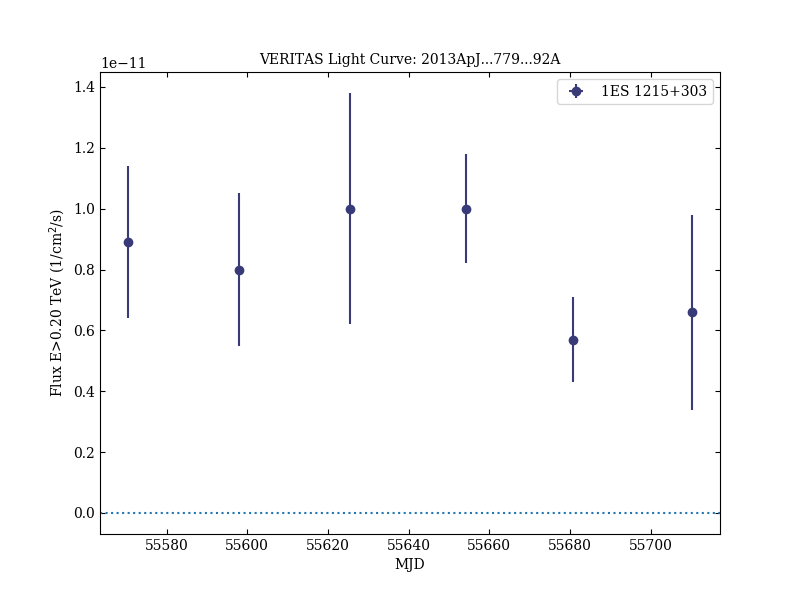
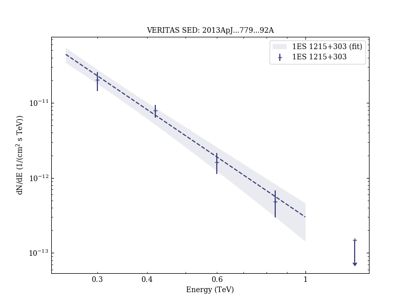
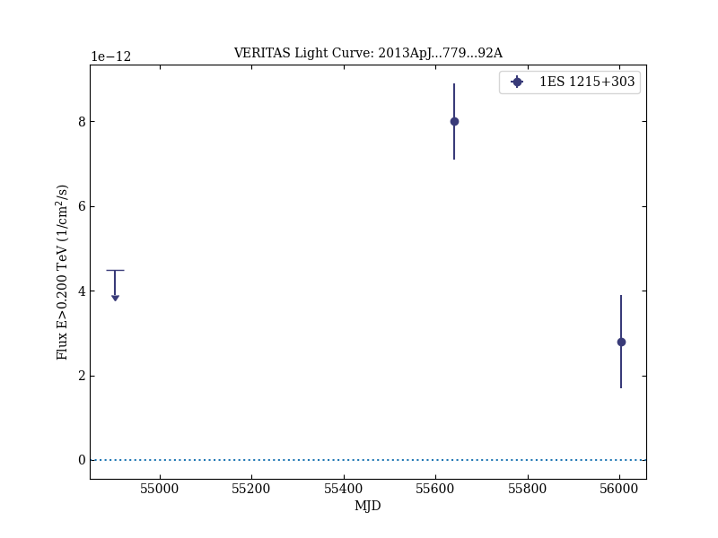

# Long Term Observations of B2 1215+30 with VERITAS

Reference:
Aliu, E. et al. (The VERITAS Collaboration), The Astrophysical Journal, 779, 92 (2013)

- ADS: [2013ApJ...779...92A](http://adsabs.harvard.edu/abs/2013ApJ...779...92A)
- DOI: [10.1088/0004-637X/779/2/92](https://doi.org/10.1088/0004-637X/779/2/92)

## 1ES 1215+303 (VER J1217+301)
### Data files

- observation data: [VER-000053.yaml](VER-000053.yaml)
- spectral data: [VER-000053-sed.ecsv](VER-000053-sed.ecsv)
- light-curve data: [VER-000053-lc-1.ecsv](VER-000053-lc-1.ecsv)  [VER-000053-lc-2.ecsv](VER-000053-lc-2.ecsv)
- observation data and fit results: [VER-000053.yaml](VER-000053.yaml)

### Figures

