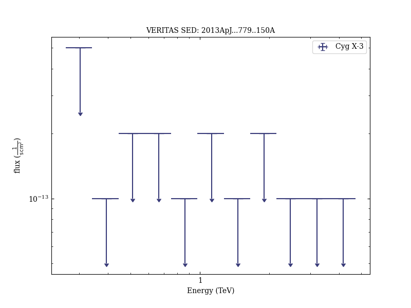

# VERITAS Observations of the Microquasar Cygnus X-3

Reference:
Archambault, S. et al. (The VERITAS Collaboration), The Astrophysical Journal, 779, 150 (2013)

- ADS: [2013ApJ...779..150A](http://adsabs.harvard.edu/abs/2013ApJ...779..150A)
- DOI: [10.1088/0004-637X/779/2/150](https://doi.org/10.1088/0004-637X/779/2/150)

### Data tables

- data tables: [VER-100171-table-2-softcuts.ecsv](VER-100171-table-2-softcuts.ecsv)  [VER-100171-table-2-mediumcuts.ecsv](VER-100171-table-2-mediumcuts.ecsv)  [VER-100171-table-2-hardcuts.ecsv](VER-100171-table-2-hardcuts.ecsv)  
## Cyg X-3
### Data files

- observation data: [VER-100171-1.yaml](VER-100171-1.yaml)  
- spectral data: [VER-100171-sed.ecsv](VER-100171-sed.ecsv)  
- light-curve data: [VER-100171-lc-1.ecsv](VER-100171-lc-1.ecsv)  [VER-100171-lc-2.ecsv](VER-100171-lc-2.ecsv)  
- observation data and fit results: [VER-100171-1.yaml](VER-100171-1.yaml)  

### Figures

