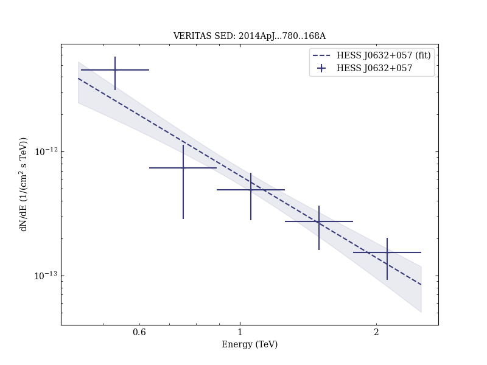
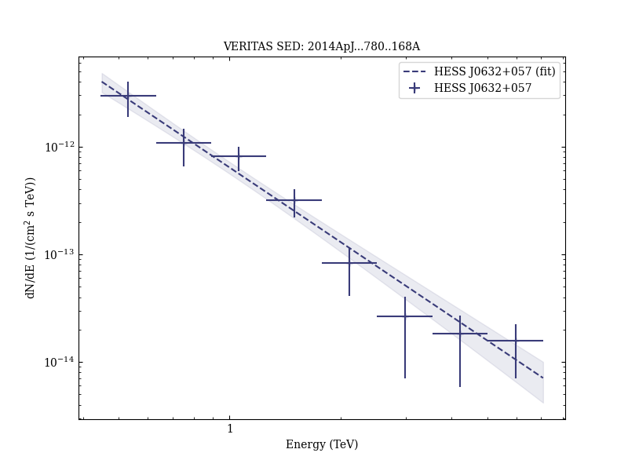
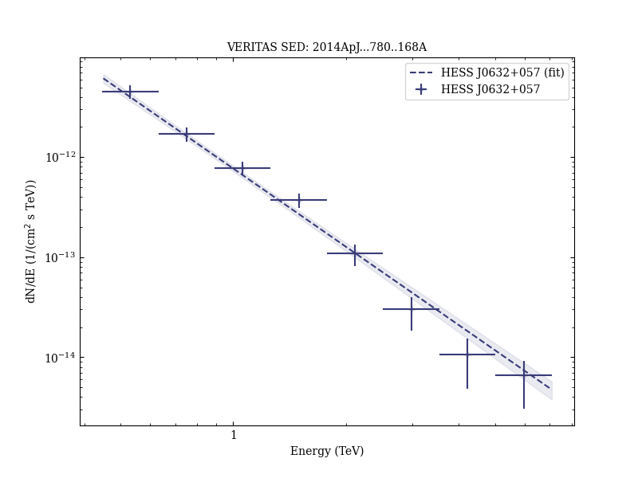

# Long-term TeV and X-Ray Observations of the Gamma-Ray Binary HESS J0632+057

Reference:
Aliu, E. et al., The Astrophysical Journal, 780, 168 (2014)

- ADS: [2014ApJ...780..168A](http://adsabs.harvard.edu/abs/2014ApJ...780..168A)
- DOI: [10.1088/0004-637X/780/2/168](https://doi.org/10.1088/0004-637X/780/2/168)

## HESS J0632+057 (VER J0633+057)
### Data files

- observation data: [VER-000030-1.yaml](VER-000030-1.yaml)  [VER-000030-2.yaml](VER-000030-2.yaml)  [VER-000030-3.yaml](VER-000030-3.yaml)  [VER-000030-4.yaml](VER-000030-4.yaml)  [HESS-000030-5.yaml](HESS-000030-5.yaml)  [HESS-000030-6.yaml](HESS-000030-6.yaml)
- spectral data: [VER-000030-sed-1.ecsv](VER-000030-sed-1.ecsv)  [VER-000030-sed-2.ecsv](VER-000030-sed-2.ecsv)  [VER-000030-sed-3.ecsv](VER-000030-sed-3.ecsv)  [VER-000030-sed-4.ecsv](VER-000030-sed-4.ecsv)  [HESS-000030-sed-5.ecsv](HESS-000030-sed-5.ecsv)  [HESS-000030-sed-6.ecsv](HESS-000030-sed-6.ecsv)
- light-curve data: [HESS-000030-lc-1.ecsv](HESS-000030-lc-1.ecsv)  [VER-000030-lc-2.ecsv](VER-000030-lc-2.ecsv)
- observation data and fit results: [VER-000030-1.yaml](VER-000030-1.yaml)  [VER-000030-2.yaml](VER-000030-2.yaml)  [VER-000030-3.yaml](VER-000030-3.yaml)  [VER-000030-4.yaml](VER-000030-4.yaml)  [HESS-000030-5.yaml](HESS-000030-5.yaml)  [HESS-000030-6.yaml](HESS-000030-6.yaml)

### Figures

